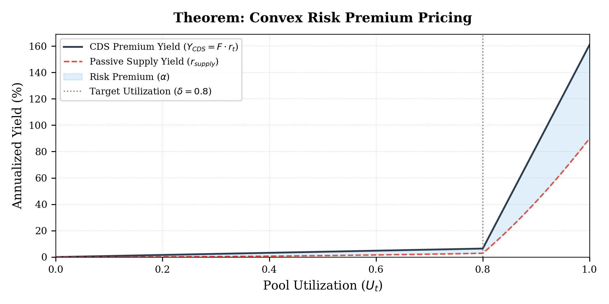
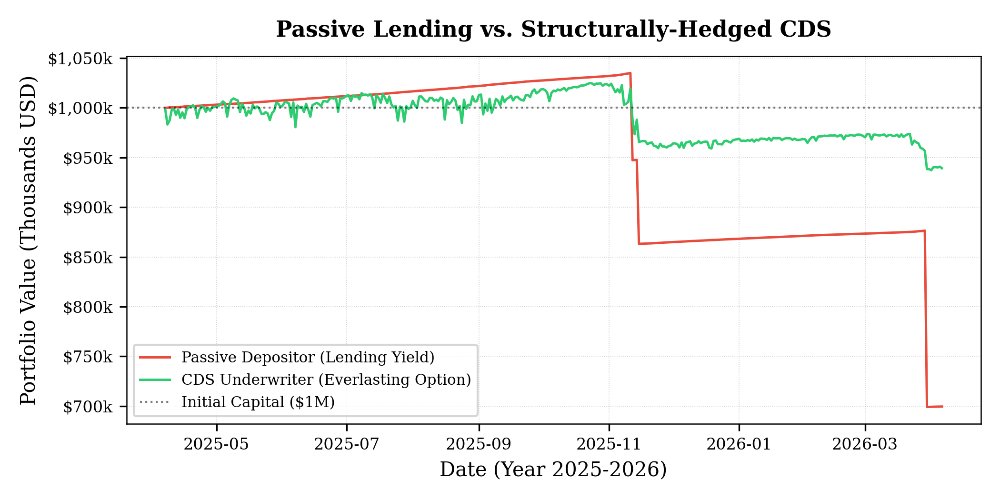

# Parametric Credit Default Swaps

On-chain insurance via rate-bounded everlasting options

## Abstract

Decentralized lending protocols secure billions of dollars in capital, yet market participants lack objective, continuous-time mechanisms to insure against systemic insolvency events. Existing decentralized insurance models replicate traditional finance paradigms by relying on subjective governance arbitration and discrete expiry dates, resulting in fragmented liquidity and settlement latency. We introduce a trustless parametric credit default swap that utilizes algorithmic interest rate models as deterministic solvency oracles. We prove that calibrating the amortization rate to the negative logarithm of the lending protocol's target utilization guarantees underwriters a strictly positive convex risk premium over passive supply rates, and derive the necessary condition on the maximum borrow rate for the invariant to hold. 

## Introduction

The pricing and transfer of default risk are fundamental to the stability of financial markets. In traditional finance, this is achieved via Credit Default Swaps (CDS) [1]. However, this architecture relies on subjective human arbitration - specifically, the International Swaps and Derivatives Association (ISDA) [2] Determinations Committees - to declare credit events, introducing latency and severe counterparty insolvency risk.

Historically, translating insurance architecture to decentralized finance (DeFi) has proven challenging due to a reliance on similar subjective state resolution. Incumbent decentralized insurance protocols such as Nexus Mutual [3] and Sherlock [4] require governance coordination to adjudicate claims, replicating ISDA friction and introducing subjective denial risk.

Our work builds on structural innovations in continuous-time market design, specifically Everlasting Options [5], Time-Weighted Average Market Makers (TWAMM) [6], and Automated Market Making under Loss-Versus-Rebalancing (LVR) [7].

We propose that the deterministic Interest Rate Models (IRMs) native to protocols such as Aave and Morpho act as continuous, parametric solvency oracles. During systemic liquidity crises, algorithmic lending rates depart from low-variance diffusion and exhibit heavy-tailed jump dynamics toward absolute maximums. By indexing an everlasting option to this rate and executing liquidity continuously via TWAMMs, we construct a fully collateralized, zero-discretion CDS market capable of algorithmically pricing tail risk.

While everlasting options have been applied to asset price exposure (Opyn Squeeth, $P^2$ perps), this work is the first to index the everlasting option structure to algorithmic interest rates as a parametric solvency-detection mechanism.

## Background and Theoretical Motivation

To establish the macroeconomic necessity of a continuous-time Credit Default Swap (CDS) within decentralized finance (DeFi), we must first formalize the exact economic nature of passive liquidity supply. The current architecture of decentralized lending is predicated on deterministic Interest Rate Models (IRMs) and algorithmic liquidation waterfalls, which inherently misprice heavy-tailed volatility and jump-to-default risk.

### The Options-Theoretic Isomorphism of Non-Recourse Debt

In traditional corporate finance, the Merton Model of Corporate Debt [11] established that secured, limited-liability debt is economically isomorphic to holding a risk-free bond while simultaneously writing a put option on the underlying collateral. Because DeFi lending relies strictly on cryptographic escrow - meaning loans are entirely non-recourse and protocols cannot enforce off-chain deficiency judgments - this options-theoretic framework can be applied directly.

Let $V_t$ represent the market value of the collateral and $D$ represent the nominal debt obligation. The borrower retains the right, but not the obligation, to repay $D$ to reclaim $V_t$. Upon terminal default, the borrower's payoff is structurally identical to holding a European call option on the collateral: $\max(V_t - D, 0)$

Conversely, the passive supplier provides $D$ and expects $D$ in return. However, if the collateral value collapses below the debt value $V_t < D$ and the protocol accrues bad debt, the supplier absorbs the loss. The supplier's terminal payoff profile evaluates to:

$$
\min(V_t, D) = D - \max(D - V_t, 0)
$$

This identity mathematically proves that supplying liquidity to a DeFi protocol equates to holding a risk-free bond $D$ while simultaneously selling a cash-secured put option $\max(D - V_t, 0)$ to the borrower. Over-collateralization parameters, such as a 75% Loan-to-Value (LTV) limit, only dictate the initial strike price, meaning the supplier is writing an out-of-the-money (OTM) put.

This structural design - where passive yield masks an embedded short-volatility position - has a direct mathematical precedent in automated market maker (AMM) geometry. As formalized by the literature surrounding the Panoptic protocol [12], providing concentrated liquidity to a Constant Function Market Maker (e.g., Uniswap V3) is mathematically equivalent to selling a perpetual, cash-secured put option. 

### Collateral Evolution: From Diffusion to Jump-to-Default

In quantitative finance, the premium collected for writing a put option must scale exponentially with the Implied Volatility $\sigma$ and credit spread of the underlying collateral. Legacy lending protocols were initially architected to accept highly liquid, foundational layer-1 assets (e.g., native ETH, WBTC). Economically, these function as "digital commodities," whose primary risk vector is exogenous market volatility following a continuous diffusion process (Geometric Brownian Motion). Under continuous diffusion, price declines are relatively smooth, allowing the protocol's algorithmic liquidators time to actively delta-hedge the position by auctioning collateral into deep secondary markets before the put option strikes in-the-money.

However, modern isolated lending markets are predominantly capitalized by yield-bearing collateral: Liquid Staking Tokens (LSTs), Liquid Restaking Tokens (LRTs), and synthetic stablecoins. Economically, these assets are not decentralized commodities; they are synthetic corporate debt. They represent unsecured claims on the cash flows, custodial integrity, and smart-contract security of third-party protocols.

Consequently, the risk profile of yield-bearing collateral is dominated not by continuous price diffusion, but by Jump-to-Default (JTD) risk, modeled as a Poisson jump process. If a yield-generating protocol suffers a smart contract exploit, slashing cascade, or custodial failure, the collateral's value does not smoothly decline - it gaps instantaneously to zero.

### The Pricing Failure of Algorithmic Interest Rates

During a JTD event, secondary market liquidity evaporates simultaneously. Algorithmic liquidators are mathematically and physically powerless to intervene because no counterparty bid exists to absorb the auction. The LTV buffer is bypassed instantaneously, the protocol's delta-hedge fails, and the supplier's short put option is violently exercised.

This exposes the fundamental flaw in utilizing static algorithmic IRMs for yield-bearing assets. IRMs natively assume that default risk is mitigated by liquidators, but liquidators cannot hedge Poisson jump risk. Furthermore, IRMs operate as algorithmic curves defined strictly as a function of capital scarcity: $r_t = f(U_t)$. Because IRMs solely price liquidity time-preference rather than credit spreads, suppliers lending against yield-bearing assets are unwittingly underwriting pure corporate default risk for unadjusted, utilization-based yields. Borrowers extract asymmetric value (unpriced volatility), while suppliers bear uncompensated tail risk.

### Unbundling Tail Risk via Parametric CDS

Because base lending protocols are mathematically incapable of dynamically pricing jump-diffusion risk, this tail exposure bleeds out of the protocol uncompensated. This structural market failure necessitates the continuous-time Parametric CDS.

The Parametric CDS unbundles the Merton identity by bifurcating the yield. The Passive Supplier streams a continuous funding rate $F$ to purchase the CDS token. In doing so, they synthetically buy back the exact put option they implicitly sold to the borrower (a Protective Put). This mathematically neutralizes their JTD exposure, transforming their position back into a true risk-free bond:

$$
\underbrace{[D - \max(D - V_t, 0)]}_{\text{Passive Lending Position}} + \underbrace{\max(D - V_t, 0)}_{\text{Protective Put}} = D
$$

The Underwriter steps in as the explicit volatility counterparty. By escrowing absolute collateral bounds $P_{max}$ to absorb the naked put, the underwriter earns the tail-risk premium.

Unlike the underlying lending protocol, the parametric CDS successfully prices this options risk. Because a delta-hedge failure inevitably strands bad debt and forces pool utilization to its deterministic absolute maximum $U_t \to 1$, the underwriter's parametrically scaled premium $Y_{CDS} = F \cdot \frac{r_t}{r_{max}}$ accelerates precisely as the put option moves in-the-money. This mechanism isolates the "liquidity yield" (retained by the supplier) from the "solvency yield" (captured by the underwriter), allowing the open market to organically price and trade the implied jump-risk of synthetic corporate debt natively on-chain.

## **State Space: Bounded Jump-Diffusions**

Standard derivative pricing assumes underlying assets follow geometric Brownian motion with normally distributed log-returns. This assumption fails for algorithmic interest rates, which exhibit bounded, mean-reverting behavior in normal regimes but transition to heavy-tailed affine jump-diffusions (AJDs) or self-exciting Hawkes processes during liquidity shocks. Gaussian distributions are explicitly rejected due to their inability to model tail risks in deterministic automated market maker (AMM) structures.

Let $r_t \in [0, r_{max}]$ denote the instantaneous annualized borrowing rate of a lending pool at time $t$. The IRM algorithmically maps pool utilization $U_t \in [0,1]$ to $r_t$. As $U_t \to 1$, the continuous piecewise function strictly dictates $r_t \to r_{max}$ to defensively halt capital flight.


*Fig 1. Morpho AdaptiveCurveIRM mapped to an option payout profile. The base rate serves as an 'out-of-the-money' baseline, while the Target Utilization ($U_t = 0.90$) acts exclusively as a Strike Price (S). Once $U_t > S$, the algorithm mechanically forces a massive convex APY expansion toward the deterministic constraint boundary.*

**The Problem Space: Algorithmic Liquidity Freezes**

Real-world data proves that the deterministic transition to jump-diffusion is an inevitability of pool architecture, not a theoretical edge case. Utilization traps are a deterministic feature of pool-based lending protocols IRM geometry.


*Fig 2. The Stream Finance Default (Nov 2025): A $93M liquidity collapse where lending protocol mechanically forced utilization to 100%, routing the IRM natively across the strike price and into the hardcap boundary (75% APY).*

**Definition 1 (The Solvency Oracle):**

We define the index price $P_{index}(t)$ of the CDS contract relative to a continuous scalar $K$ of the borrowing rate. For dollar-denominated normalization, we set $K = 100$:

$$
 P_{index}(t) = 100 \cdot r_t
$$

**Constraint 1 (Absolute Liability Bound):**

To preclude systemic undercollateralization, maximum intrinsic liability must be deterministically capped. Because the IRM is strictly bounded by $r_{max}$, the maximum intrinsic value is:

$$
 P_{max} = 100 \cdot r_{max}
$$

Underwriters must escrow exactly $P_{max}$ in orthogonal, exogenous collateral at minting. This defines a strict upper boundary condition, mathematically guaranteeing solvency under worst-case terminal states.

## Amortizing Perpetual Option Mechanics

To eliminate maturity fragmentation, the CDS operates as an Amortizing Perpetual Option (AmPO) [13]. Rather than exchanging explicit funding payments - which introduces margin-tracking overhead and liquidation risk - the premium is extracted through continuous state decay.

**Definition (State Decay):**

Let funding rate $F > 0$ represent a constant continuous decay rate. The payout coverage of all minted tokens amortizes via a global Normalization Factor $NF(t)$:

$$
 NF(t) = e^{-F \cdot t}
$$

where $t$ is expressed in annualized units. Given continuous arbitrage and frictionless execution, the spot price $P_{mkt}(t)$ of the token on a secondary AMM converges strictly to its discounted intrinsic value:

$$
 P_{mkt}(t) = 100 \cdot r_t \cdot e^{-F \cdot t} 
$$


*Fig 3. The Over-Collateralization Trap of Everlasting Option: If liability decays continuously while escrow remains locked, the capital backing-per-token geometrically increases.*

## **Yield Invariance and Convex Pricing**

For continuous market equilibrium, the expected yield captured by the underwriter $Y_{CDS}$ must strictly exceed the opportunity cost of passively supplying capital to the underlying lending pool $r_{supply}$.

**Invariant (Supply-Side Floor):**

$$
 Y_{CDS} \geq r_{supply} 
$$

**Theorem of Convex Risk Premium via Target Utilization:**

*Let $\delta \in (0, 1)$ be the optimal target utilization parameter defined by the lending protocol's IRM, and let $R \in [0, 1)$ be the protocol's reserve factor. Let $r_{max} \in (0, 1]$ represent the absolute maximum borrow rate limit. Setting the decay rate to $F = -\ln(1 - \delta)$ mathematically guarantees the underwriter captures a strictly positive premium over the passive supply rate globally across all continuous utilization states $U_t \in [0, 1]$ if and only if:*

$$
r_{max} \le \frac{-\ln(1 - \delta)}{(1 - R)}
$$

**Derivation of $Y_{CDS}$:**

The underwriter vault holds constant exogenous collateral $C_{locked}$ backing an initial token position $Q(0) = C_{locked}/P_{max}$. Over infinitesimal interval $dt$, the NF decay $NF(t) = e^{-Ft}$ unlocks collateral worth $dC = C_{locked} \cdot F \cdot dt$. The vault mints $dQ$ new tokens and sells at the prevailing spot price $P_{mkt}(t) = P_{max} \cdot (r_t / r_{max}) \cdot NF(t)$. Revenue per unit time:

$$
\frac{d\text{Rev}}{dt} = \frac{dQ}{dt} \cdot P_{mkt}(t) = \frac{C_{locked}}{P_{max}} F e^{Ft} \cdot P_{max} \cdot \frac{r_t}{r_{max}} \cdot e^{-Ft} = C_{locked} \cdot F \cdot \frac{r_t}{r_{max}}
$$

Normalizing by $C_{locked}$, the underwriter's realized continuous Return on Equity is:

$$
Y_{CDS} = F \cdot \left( \frac{r_t}{r_{max}} \right)
$$

***Proof of global invariant:***

The dynamic passive supply rate of a lending pool is the product of utilization, the borrow rate, and the unreserved fraction: $r_{supply} = U_t \cdot r_t \cdot (1-R)$.

To guarantee the yield invariant $Y_{CDS} \ge r_{supply}$ holds globally, it must hold at the absolute supremum of the state space, which occurs at terminal utilization $U_t=1$. At this state, the borrow rate reaches its deterministic maximum $r_t = r_{max}$, yielding a maximum passive supply rate of:

$$
r_{supply}(1) = 1 \cdot r_{max} \cdot (1-R)
$$

At $U_t=1$, the underwriter yield simplifies to exactly the absolute decay rate:

$$
Y_{CDS}(1) = F \cdot \left(\frac{r_{max}}{r_{max}}\right) = F
$$

Therefore, for the invariant to hold at the terminal limit, the system strictly requires:

$$
F \ge r_{max}(1-R) \implies r_{max} \le \frac{F}{1-R} = \frac{-ln(1-\delta)}{1-R}
$$

Because the underwriter yield scales linearly with $r_t$, while the passive supply rate scales with the product $U_t \cdot r_t$, establishing the boundary condition at $U_t=1$ mathematically guarantees the invariant holds at all lower utilization states, including target equilibrium.

**Decomposition of the Structural Risk Premium:**

The structural risk premium $\alpha$ is defined as the real-time spread between the underwriter's fixed linear payout constraint and the passive supplier's dynamic yield floor.

Because the maximum borrow rate $r_{max}$ is constrained by $r_{max} \le \frac{F}{1-R}$, we know that $\frac{F}{r_{max}} \ge 1-R$. Therefore, rewriting the underwriter yield equation:

$$

Y_{CDS} = F \cdot \left(\frac{r_t}{r_{max}}\right) = \left(\frac{F}{r_{max}}\right) \cdot r_t

$$

The yield decomposes as:

$$
Y_{CDS} \ge \underbrace{U_t \cdot r_t \cdot (1 - R)}_{r_{supply}} + \underbrace{\alpha(U_t, r_t, R, r_{max}, F)}_{\text{Risk Premium}}
$$

where the exact structural risk premium $\alpha \ge 0$ is mathematically defined by the absolute boundary limits, isolated as:

$$
\alpha = \left( \frac{F}{r_{max}} - U_t(1 - R) \right) \cdot r_t
$$

**Maclaurin Series Expansion of the Risk Premium:**

The baseline premium captured by this parameterization, can be computed by expanding the static constant $F=-ln(1-\delta)$ via its Maclaurin series for $\delta\in[0,1)$:

$$
F = \sum_{n=1}^{\infty}\frac{\delta^{n}}{n} = \delta + \frac{\delta^{2}}{2} + \frac{\delta^{3}}{3} + \mathcal{O}(\delta^{4})
$$

Substituting this expanded polynomial series into the risk premium equation yields:

$$
\alpha = r_t \cdot \left[ \frac{1}{r_{max}} \left( \delta + \frac{\delta^{2}}{2} + \frac{\delta^{3}}{3} + \dots \right) - U_t(1 - R) \right]
$$

This expansion mathematically proves that the risk premium is not defined by just linear padding. As the lending protocol configures a more aggressive target utilization $\delta \to 1$, the higher-order terms $\frac{\delta^2}{2}, \frac{\delta^3}{3}$ amplify geometrically. To physically survive the absolute boundary constraint, the system structurally forces either an exponentially higher decay rate $F$ or a much tighter $r_{max}$, deterministically transferring tail-risk convexity to the underwriter prior to the $U_t \to 1$ event without conflating the dynamic and static domains.

This spread dynamically widens whenever $U_t < 1$, ensuring underwriters are appropriately compensated during standard operations. At the extreme limit $U_t = 1$, the premium $\alpha$ deterministically closes exactly at zero only if the protocol's parameterization rides precisely on the boundary, and cleanly remains strictly positive if the protocol governs underneath it.

Critically, while the continuous CDS payout $Y_{CDS}$ is mathematically linear with respect to the instantaneous index rate $r_t$, it intrinsically inherits the dynamic payout convexity of the underlying lending pool's IRM with respect to pool utilization $U_t$. As utilization crosses the target $U_t > \delta$, the IRM geometrically bends toward $r_{max}$. By indexing linearly to this deterministically convex oracle, the underwriter yield accelerates convexly precisely during liquidity shocks, capturing tail-risk upside without relying on path-dependent options math.

**Corollary (Practical Validity):** The following table confirms the condition holds for all major lending protocol configurations based on April 2026 parameters:

| Protocol | $\delta$ | $R$ | $F$ | Max valid $r_{max}$ | Actual $r_{max}$ | Holds? |
| --- | --- | --- | --- | --- | --- | --- |
| Aave V3 USDC | 0.92 | 0.10 | 2.303 | 256% | 75% | Yes |
| Aave V3 WETH | 0.92 | 0.10 | 2.303 | 256% | 80% | Yes |
| Compound V3 USDC | 0.90 | 0.10 | 1.609 | 179% | 150% | Yes |
| Euler V2  | 0.90 | 0.10 | 1.897 | 211% | 100% | Yes |
| Morpho (moderate) | 0.90 | 0.00 | 2.303 | 230% | 200% | Yes |
| Morpho (aggressive) | 0.90 | 0.00 | 2.303 | 230% | 400% | **No** |

For Morpho markets with $r_{max}$ exceeding the validity bound, the protocol must either adjust $F$ upward or restrict CDS deployment to markets satisfying the condition.

**Parameter Sensitivity**

The risk premium $\alpha$ exhibits differential sensitivity to its governing parameters:

| Parameter | Perturbation | Effect on $\alpha$ | Interpretation |
| --- | --- | --- | --- |
| $F$ (decay rate) | +10% | $\alpha$ increases linearly | Direct: higher decay = more premium |
| $\delta$ (target utilization) | 0.85 $\to$ 0.90 | $F$ increases 21% 
($1.90 \to 2.30$) | Super-linear: Maclaurin terms amplify near $\delta = 0.9$ |
| $R$ (reserve factor) | 0.10 $\to$ 0.15 | $\alpha$ increases, $r_{supply}$ decreases | Reserve capture widens the spread |
| $r_{max}$ (rate cap) | 0.75 $\to$ 1.125 (+50%) | $\alpha$ decreases inversely | Higher caps dilute premium per unit collateral |

The system is most sensitive to $\delta$: a shift from $\delta = 0.80$ to $\delta = 0.90$ increases $F$ by 43%, producing a disproportionately larger risk premium. This reflects economic reality - pools operating closer to the kink carry greater jump-diffusion risk.



*Fig 4. Maclaurin Expansion in practice: Graphing $Y_{CDS}$ and $r_{supply}$ against continuous pool utilization shows the strictly positive convexity coefficient pricing the inherent tail-risk embedded in the structural bounds.*

## **Market Microstructure and Execution Friction**

Holding static balances of an AmPO induces inventory decay drag. We enforce a deterministic microstructure to achieve systemic equilibrium, explicitly incorporating physical execution constraints.

**Fiduciary Execution: Constant-Coverage TWAMM**

To maintain constant absolute coverage $C$, a fiduciary must counteract the $e^{-Ft}$ decay by exponentially growing their token balance:

$$
N(t) = \frac{C}{P_{max}} e^{Ft}
$$

The continuous acquisition rate is:

$$
\frac{dN}{dt} = \frac{C}{P_{max}} F e^{Ft}
$$

Evaluating this flow at spot price $P_{mkt}(t)$, the cash stream evaluates to:

$$
\text{Stream} = \left( \frac{C}{P_{max}} F e^{Ft} \right) \times \left( P_{max} \cdot \left(\frac{r_t}{r_{max}}\right) \cdot e^{-Ft} \right) = C \cdot F \cdot \left(\frac{r_t}{r_{max}}\right)
$$

The exponential growth and decay factors mathematically cancel each other. The TWAMM strictly outputs constant-dollar coverage at a duration-neutral continuous premium.

## **Underwriter Execution**

If underwriters hold pre-minted inventory, liability amortization erodes the $\alpha$ premium. Optimal execution utilizes an ERC-4626 Vault performing Just-In-Time (JIT) underwriting. Let $C_{locked}$ represent constant exogenous collateral. The vault dynamically sweeps unlocking collateral to mint active tokens $Q(t) = \frac{C_{locked}}{P_{max}} e^{Ft}$.

**LVR Internalization** Heavy-tailed jumps in $r_t$ introduce severe LVR for passive AMM liquidity providers. Because passive $x \cdot y = k$ providers suffer deterministic adverse selection against informed arbitrageurs during insolvency events, the microstructure specifically routes Underwriter JIT supply directly against TWAMM demand. Internalizing the Coincidence of Wants (CoW) circumvents the passive AMM curve, mathematically neutralizing LVR bleed and allowing underwriters to capture the theoretical supremum yield.

**EVM Discrete Integration**

Unlike discrete recursive integration which introduces Euler drift, the implementation evaluates the analytical solution $NF(t_k) = \exp(-F \cdot t_k)$ at discrete block timestamps. Execution error is thus strictly confined to [IEEE-754](https://ieeexplore.ieee.org/document/8766229) equivalent fixed-point precision truncation (e.g., 18-decimal `WAD`), rendering time-discretization drift mathematically non-existent.

**Adversarial Robustness and Boundary Conditions**

Parametric models are vulnerable to oracle manipulation and dependency failures. We enforce structural boundaries to guarantee robust state resolution.

**Constraint 3 (Collateral Orthogonality):**

$$
 Cov(\text{Collateral Value}, \text{Insured Event}) \le 0 
$$

Underwriters must post strictly exogenous collateral. This prevents recursive dependency (the "Burning House" paradox), ensuring payout liquidity survives the insured systemic event.

**Constraint 4 (Multi-Track Settlement Trigger):**

Lending pool insolvency is a function of two independent state-space axes: **supply pressure** 
$U_t = B/D$, endogenous and **collateral adequacy** $HF = \sum C_i P_i / B$, oracle-dependent. To ensure robust detection across both axes while resisting single-vector manipulation, the protocol transitions to terminal global settlement if **at least 2 of 3** independent tracks trigger simultaneously. Each track enforces a 7 days time-weighted moving average (TWMA) filter:

| Track | Condition | Axis | Source | Rationale |
| --- | --- | --- | --- | --- |
| **A: Utilization Freeze** | $U_t \ge 0.99$ for 7 days | Supply pressure | Endogenous | Withdrawals revert; capital physically frozen by EVM pool constraints |
| **B: Collateral Collapse** | Weighted collateral price $\le 0.25 \times P_0$ (−75%) | Borrower health | Oracle (Chainlink / TWAP) | Loans are underwater; liquidation recovery < debt |
| **C: Bad Debt Accrual** | Protocol-reported bad debt $> 0$ and increasing | Buffer exhaustion | Hybrid (on-chain accounting) | Liquidation mechanism has failed; losses exceed reserves |

The 2-of-3 quorum ensures genuine insolvency - which structurally affects multiple state variables simultaneously - is distinguished from isolated anomalies.

**Adversarial Exploitation Defense:**

To force a false settlement, an attacker must sustain two conditions for 7 days simultaneously:

- **Track A**: Sustaining $U_t \ge 0.99$ for 7 days requires continuously borrowing at $r_{max}$. The pool broadcasts an arbitrage-inducing supply rate; yield-seeking capital and MEV bots route liquidity in for chasing arbitrage opportunities, breaking the attack's expected value.
- **Track B**: Manipulating weighted collateral price by −75% for 7 days requires attacking spot markets across all venues - economically infeasible for any asset with >$1B market cap.
- **Track C**: Fabricating bad debt requires either (a) actual protocol exploit (in which case settlement SHOULD fire), or (b) compromising the lending protocol's accounting contracts - an attack on the protocol itself, not on the CDS.

**Conditions set per each market individually.*

**Counterparty Flight Prevention:**

Track A acts as a physical capital trap. A genuine crisis immediately spikes utilization, causing `withdrawCollateral()` to revert due to EVM pool liquidity constraints. Underwriters are physically frozen *before* the 7 days TWMA filter formalizes settlement. Tracks B and C serve as independent circuit-breakers for scenarios where utilization alone is insufficient (e.g., gradual collateral depreciation without an immediate bank run).

**Correlated Settlement Risk**

The portfolio diversification argument assumes pairwise independence $\rho_{ij} \approx 0$ across markets. Under systemic events (e.g., stablecoin depeg, coordinated liquidation cascade), correlation approaches $\rho \to 1$, potentially triggering simultaneous settlements across $k$ of $N$ insured markets.

**Worst-case bound:** An underwriter with total collateral $C_{total}$ distributed across $N$ markets can survive at most $k^* = \lfloor C_{total} / P_{max} \rfloor$ simultaneous settlements. Because each market's maximum liability is bounded by $P_{max}$ (Constraint 2), the problem reduces to a capital adequacy question rather than an unbounded tail risk.

**Oracle Incentive Alignment via Symbiotic Restaking**

Settlement Tracks B (collateral price) and C (bad debt) require external data, introducing an oracle dependency. We propose a flywheel: oracle operators stake `wstETH` via a restaking protocol (e.g., Symbiotic) and receive a proportion $\beta$ of CDS premium revenue in exchange for reporting Track A/B/C observables. Malicious reports trigger slashing of the operator's restaked principal.

**Flywheel structure:**

```
wstETH holders -> stake -> Oracle Operators -> report -> Settlement Tracks A, B, C
       ^                                                       |
       |                  β · Y_CDS revenue                    |
       └───────────────────────────────────────────────────────┘
```

The operator's staked `wstETH` simultaneously serves as: (a) oracle security bond, (b) underwriter escrow (via Constraint 3), and (c) ETH staking yield source - triple-utilizing the same capital.

**Hypothesis (Honest Equilibrium):** *Under the proposed symbiotic flywheel, rational oracle operators are incentivized to report correct values and will not cooperate for malicious settlement.*

***Proof of honest equilibrium (sufficient conditions):***

Let $S_i$ denote operator $i$'s staked value, $R$ the continuous CDS revenue share per period, $r_d$ the discount rate, $V_{attack}$ the value capturable via false settlement $= \sum_j P_{max,j}$ across affected markets, and $q$ the quorum fraction required for oracle consensus.

An operator's expected utility under honest reporting is:

$$
U_{honest} = \frac{R}{r_d} + S_i
$$

Under a one-shot deviation (collude to force false settlement), the expected utility is:

$$
U_{attack} = \frac{V_{attack}}{|C|} - p_{slash} \cdot S_i
$$

where $|C| \ge \lceil qN \rceil$ is the minimum coalition size, and $p_{slash}$ is the slashing probability.

The honest equilibrium holds iff $U_{honest} > U_{attack}$ for all operators:

$$
\frac{R}{r_d} + S_i > \frac{V_{attack}}{|C|} - p_{slash} \cdot S_i
$$

$$
(1 + p_{slash}) \cdot S_i + \frac{R}{r_d} > \frac{V_{attack}}{\lceil qN \rceil}
$$

For $q = 2/3$ and $p_{slash} = 1$ (full slashing):

$$
2S_i + \frac{R}{r_d} > \frac{V_{attack}}{\lceil 2N/3 \rceil}
$$

This holds when operator stake and revenue NPV jointly exceed the per-operator share of the attack value. Under normal conditions - modest CDS TVL relative to aggregate operator stake - this inequality is comfortably satisfied.

***Rejection: the crisis-correlation inversion***

The hypothesis fails under the precise conditions when the CDS is most needed. During a systemic crisis:

1. **Stake depreciation** - Operators stake `wstETH`. A systemic event (e.g., ETH crash, Lido slashing cascade) simultaneously depreciates $S_i$. If ETH drops 50%, slashing penalty is halved in real terms: $S_i \to 0.5 \cdot S_i$. The left side of the inequality **weakens**.
2. **Attack value inflation** - During a crisis, CDS tokens trade at maximum intrinsic value $P_{max}$. The total settlement payout $V_{attack}$ is at its peak. The right side of the inequality **strengthens**.
3. **Revenue destruction** - A false settlement terminates the CDS protocol's operation for affected markets, destroying future revenue $R$. But if the attacker profits $V_{attack} / |C|$ from a long CDS position, they are indifferent to future revenue.

**The critical inversion occurs when:**

$$
2 \cdot S_i^{crisis} + \frac{R}{r_d} < \frac{V_{attack}^{crisis}}{\lceil 2N/3 \rceil}
$$

Since $S_i^{crisis} < S_i^{normal}$ and $V_{attack}^{crisis} > V_{attack}^{normal}$, there exists a CDS TVL ratio $\lambda^*$ beyond which the inequality inverts. A naive data-reporting oracle is therefore **insufficient** at scale.

**Resolution: ZK-Proven State Attestation**

The crisis-correlation inversion arises because operators *report* data - they can lie. We eliminate the correctness attack surface entirely by requiring operators to generate **zero-knowledge proofs of on-chain state** rather than subjective reports.

**Mechanism:**

Operators read Track B/C observables from their canonical on-chain sources (lending markets native oracle price feeds for collateral prices, `getReserveData()` for bad debt) and generate a ZK proof attesting:

$$
\pi_t = \text{ZKProof}\Big(\text{source}_{chain}(t) \to \text{value}_t\Big)
$$

**Attack surface reduction:**

| Model | Attack vector | Quorum to attack | Coordination type |
| --- | --- | --- | --- |
| Data reporting | **Correctness** (lie about values) | $\lceil 2N/3 \rceil$ operators collude | Active (agree on false value) |
| ZK attestation | **Liveness only** (stop proving) | **All $N$ operators** must stop | Passive (silence) |

The CDS settlement contract verifies $\pi_t$ on-chain. A valid proof guarantees that the reported value is the *actual* on-chain state at the attested block - the operator **cannot fabricate data** because no valid proof exists for a false statement.

With ZK proofs, a single honest operator submitting one valid proof is sufficient to provide correct data. The attack is no longer "convince 2/3 to lie" but "convince ALL to stop" - an exponentially harder coordination problem.

**Liveness-as-Default (Fail-Safe):**

If no valid proof is submitted within window $T$ (e.g., 4 hours), the smart contract treats the unreported value as zero:

$$
\text{value}_t = \begin{cases} \text{ZK-attested value} & \text{if } \pi_t \text{ submitted within } T \\ 0 & \text{if no proof in } [t-T, t] \end{cases}
$$

A zero-value for Track B (collateral price = 0) and Track C (bad debt treated as maximal) causes both tracks to immediately fire. This makes the system **fail-safe by construction**: silence triggers settlement, forcing the conservative outcome.

**Liveness incentive analysis:**

Under ZK attestation, the attack reduces to coordinated silence. The attacker's utility becomes:

$$
U_{silence} = \frac{V_{attack}}{N} - p_{slash} \cdot S_i - \frac{R}{r_d}
$$

The honest equilibrium now requires:

$$
\frac{R}{r_d} + (1 + p_{slash}) \cdot S_i > \frac{V_{attack}}{N}
$$

Critically, the denominator is now $N$ (ALL operators must stop), not $\lceil 2N/3 \rceil$. For $N = 10$ operators, the per-operator attack share is $V_{attack}/10$ vs. $V_{attack}/7$ - a 30% reduction. For $N = 100$, it is $V_{attack}/100$ vs. $V_{attack}/67$ → a 3x reduction.

Furthermore, coordinated silence is **self-defeating**: if even one operator defects from the silence cartel and submits a valid proof (earning the full reporting reward while competitors are slashed), the attack fails. This is a anti-coordination game where defection is the dominant strategy.

**Implication:** The ZK-attested oracle with liveness-as-default constitutes a **practically trustless** settlement mechanism when combined with:

1. **Permissionless proving**: Any party can generate and submit a valid ZK proof, not just registered operators - ensuring liveness even if the entire operator set goes offline
2. **Slashing for liveness failure**: Registered operators who fail to submit proofs within $T$ are slashed, aligning their incentive with continuous attestation
3. **Track A as trustless anchor**: Utilization remains fully endogenous and requires no oracle - the system degrades gracefully if ZK infrastructure fails

## Limitations and Boundary Conditions

This mechanism design is subject to the following structural constraints and failure modes:

**IRM Governance Risk.** Protocol governance (e.g., Aave AIPs, Morpho market creation) can modify $r_{max}$, kink parameters, and slope coefficients. An upward revision of $r_{max}$ beyond the validity bound $\frac{F}{\delta(1-R)}$ would violate the yield invariant for existing positions. Mitigation: the protocol should monitor IRM parameter changes and trigger position unwinding or re-collateralization when the validity bound is approached.

**Correlated Tail Risk.** The portfolio diversification argument assumes pairwise independence 
$\rho_{ij} \approx 0$. Systemic events - such as a stablecoin depeg or coordinated liquidation cascade - can drive $\rho \to 1$ across multiple markets simultaneously. Under full correlation, the portfolio reduces to a single effective market, eliminating the $\sqrt{N}$ variance reduction. The worst-case loss is bounded by $k \cdot P_{max}$ for $k$ simultaneous settlements, but capital adequacy must be sized accordingly.

**Liquidity Bootstrapping.** The TWAMM-JIT CoW internalization assumes sufficient bilateral flow between fiduciary buyers and JIT underwriter sellers. In nascent or thin markets, demand-supply imbalance routes residual flow through the passive AMM curve, reintroducing LVR. The mechanism reaches full efficiency only after a critical mass of bilateral flow is established.

**$r_{max}$ Validity Bound.** The convex risk premium invariant requires $r_{max} \le \frac{-\ln(1-\delta)}{1-R}$. Aggressively configured IRMs (e.g., Morpho markets with $r_{max} > 300\%$) may violate this condition. The protocol must enforce market eligibility criteria based on this bound.

**Smart Contract Risk.** The mechanism's adversarial robustness analysis addresses economic attack vectors but is orthogonal to implementation risk. Smart contract bugs in the Normalization Factor computation, the Bivariate Temporal Trap evaluation, or the ERC-4626 JIT Vault logic represent the primary practical attack surface.

**Moral Hazard.** If CDS coverage becomes widespread, insured protocols may tolerate riskier IRM configurations (higher $\delta$, lower $r_{max}$), knowing depositors are hedged. This reflexive dynamic could increase crisis frequency while compressing the risk premium $\alpha$.

**Equilibrium Penetration.** At 100% insurance penetration, all supply-side yield must fund the CDS premium, driving $\alpha \to 0$ and making underwriting unprofitable. In practice, equilibrium penetration is bounded by the supply-side participation constraint: underwriters exit when $\alpha$ falls below their required hurdle rate, establishing a natural floor.

## Portfolio Cohort Backtest (2025-2026)

We subjected the physical mechanisms to a historical performance evaluation over April 2025 - April 2026 across 12 high-liquidity Morpho USDC lending markets with more than $100k deposits.

**Simulation Parameters:**

- **Market selection**: 12 Morpho Blue USDC vaults with >$100k total supply, active throughout the evaluation period
- **Terminal failure definition**: Utilization $U_t \ge 0.99$ sustained for 7 consecutive days (168 hours)
- **Decay rate**: $F = -\ln(1 - \delta)$ with $\delta = 0.80$, yielding $F = 1.609$
- **Allocation**: Equal-weight by notional $C_{locked}/N$ per market for Fig 5; risk-budgeted (tiered weighting: $3\times$ blue-chip, $1\times$ intermediate, $0.2\times$ exotic) for Fig 6
- **Collateral**: $P_{max} = \$100$ escrow per unit in exogenous assets (simulated wstETH at 3.5% staking yield)
- **Risk-free rate**: 4% annualized (T-bill proxy for Sharpe/Sortino computation)

**Table 1: Initial Market Allocation and Tiering**

| Collateral | Tier | Init. Rate | Init. Util. | EW Alloc. | RB Weight | RB Alloc. |
| --- | --- | --- | --- | --- | --- | --- |
| WBTC | T1 | 4.0% | 88.4% | $83,333 | 17.9% | $178,571 |
| cbBTC | T1 | 4.0% | 88.3% | $83,333 | 17.9% | $178,571 |
| wstETH | T1 | 4.2% | 88.8% | $83,333 | 17.9% | $178,571 |
| tBTC | T1 | 6.0% | 80.2% | $83,333 | 17.9% | $178,571 |
| srUSD | T2 | 5.4% | 79.4% | $83,333 | 6.0% | $59,524 |
| syrupUSDC | T2 | 4.4% | 60.0% | $83,333 | 6.0% | $59,524 |
| sUSDe | T2 | 6.0% | 82.8% | $83,333 | 6.0% | $59,524 |
| LBTC | T2 | 4.7% | 90.1% | $83,333 | 6.0% | $59,524 |
| USR | T3 | 3.9% | 83.3% | $83,333 | 1.2% | $11,905 |
| sdeUSD | T3 | 0.1% | 90.0% | $83,333 | 1.2% | $11,905 |
| RLP | T3 | 5.9% | 78.3% | $83,333 | 1.2% | $11,905 |
| USCC | T3 | 2.3% | 60.3% | $83,333 | 1.2% | $11,905 |

Tier 1 (blue-chip BTC/ETH wrappers) receives 71.4% of risk-budgeted capital across 4 markets. Tier 3 (exotic/novel collateral) receives 4.8% across 4 markets. Initial borrow rates ranged from 0.1% (sdeUSD) to 6.0% (tBTC, sUSDe), with mean utilization of 82.5% across the cohort.

**Default Events:** 4 of 12 markets (33%) experienced terminal settlement:

| Market | Default Day | Max Rate Observed | Classification |
| --- | --- | --- | --- |
| sdeUSD | Day 218 | 297,996% | Tier 3 (Exotic) |
| USCC | Day 221 | 61.7% | Tier 3 (Exotic) |
| USR | Day 356 | 172.2% | Tier 3 (Exotic) |
| RLP | Day 356 | 357.1% | Tier 3 (Exotic) |

All four defaulted markets belong exclusively to the exotic (Tier 3) tranche. Zero blue-chip (Tier 1) or intermediate (Tier 2) markets defaulted during the evaluation period. Non-defaulting markets exhibited a time-averaged borrow APY of 5.62% (median: 5.98%) and mean utilization of 85.5%.



*Fig 5. One-Year Cohort Projection ($1M Principal): Integrating the structural decay mathematics of the CDS mechanism transforms the 100% absolute losses incurred by passive lenders (Red) into structurally amortized downside cliffs (Green).*


*Fig 6. Risk-Budgeted Cohort Projection ($1M Principal): Under proportional asset tiering, the CDS Underwriter immunizes the portfolio against the physical default series, crossing the zero-bound to extract net positive absolute returns while the native suppliers faced losses.*

**Table 2: Portfolio Risk-Adjusted Performance ($1M Initial Capital)**

| Metric | EW Passive | EW Underwriter | RB Passive | RB Underwriter |
| --- | --- | --- | --- | --- |
| Terminal Value | $699,469 | $939,284 | $996,362 | $1,025,548 |
| Return | −30.05% | −5.91% | −0.36% | +2.91% |
| Ann. Volatility | 23.70% | 11.53% | 3.01% | 11.34% |
| Sharpe Ratio | −1.55 | −0.82 | −1.43 | −0.04 |
| Sortino Ratio | −0.82 | −0.76 | −0.85 | −0.04 |
| VaR (95%, daily) | +0.007% | −1.070% | +0.006% | −0.852% |
| VaR (99%, daily) | −0.005% | −2.005% | −0.004% | −1.687% |
| Max Drawdown | −32.46% | −8.56% | −3.48% | −4.29% |

Under equal-weight allocation, the passive depositor suffered a 30.1% loss driven by complete capital destruction in four defaulted markets ($333,333 exposed, 33.3% of portfolio). The CDS underwriter's structural amortization reduced this to a 5.9% loss - the exponential decay of the Normalization Factor erased 80% of the default liability before settlement, with residual CDS value of $245,742 recovered from the four defaulted positions.

Under risk-budgeted allocation - weighting Tier 1 (blue-chip) at $3\times$ and Tier 3 (exotic) at $0.2\times$ - only $47,619 (4.8%) of capital was exposed to defaults. The CDS underwriter achieved a strictly positive return of +2.91% with a maximum drawdown of −4.29%, while the passive depositor realized −0.36%. The 99% daily Value at Risk of the risk-budgeted underwriter was −1.687%, confirming bounded tail exposure consistent with the deterministic $P_{max}$ liability ceiling.

**Yield-Stacking via Orthogonal Collateral**

Constraint 3 (Collateral Orthogonality) mandates that underwriters post strictly exogenous collateral to prevent recursive dependency. By utilizing cross-margin functionality within the ERC-4626 Underwriter Vault, a sophisticated capital allocator can post yield-bearing assets such as Liquid Staking Tokens like `wstETH` or tokenized T-bills (representing risk-free yield-bearing collateral) as the orthogonal escrow.

This architecture establishes a yield-stacking loop: the underwriter accrues the endogenous native staking yield $r_{staking} \approx 3\%-4\%$ combined with the continuous systemic underwriting premium $Y_{CDS} = r_{supply} + \alpha \approx 5\%-6\%$. By executing this structurally hedged, delta-neutral underwriting strategy, the allocator can achieve up to 10% APY against underlying asset. This capital efficiency converts passive collateral into an active systemic backstop liquidity.

## Conclusion

By mapping algorithmic interest rate bounds to amortizing perpetual option mathematics, we establish a verifiable, fully collateralized parametric credit default swap. The calibration of the funding rate against target utilization yields a mathematically strict pricing model that compensates tail risk via convex expansion. Executed through continuous streaming infrastructure and governed by bivariate temporal constraints, this design neutralizes duration risk, mitigates inventory inefficiency, and resists adversarial manipulation, providing a secure primitive for decentralized risk transfer.

## **References**

[1] Duffie, D. (1999). Credit Swap Valuation. Financial Analysts Journal, 55(1), 73-87.

[2] International Swaps and Derivatives Association (ISDA). (2026). Determinations Committees Rules.

[3] Nexus Mutual. (2026). Nexus Mutual Whitepaper.

[4] Sherlock. (2026). Sherlock Protocol Documentation.

[5] White, D., & Bankman-Fried, S. (2021). Everlasting Options. Paradigm Research.

[6] Adams, A., Robinson, D., & White, D. (2021). Time-Weighted Average Market Makers (TWAMM). Paradigm Research.

[7] Milionis, J., Moallemi, C. C., Roughgarden, T., & Zhang, A. L. (2022). Automated Market Making and Loss-Versus-Rebalancing. arXiv preprint arXiv:2208.06046.

[8] Bacry, E., Mastromatteo, I., & Muzy, J. F. (2015). Hawkes Processes in Finance. Market Microstructure and Liquidity, 1(01), 1550005.

[9] Ni, S., & Roughgarden, T. (2025). Amortizing Perpetual Options. arXiv preprint arXiv:2512.06505.

[10] IEEE Computer Society. (2019). IEEE Standard for Floating-Point Arithmetic. IEEE Std 754-2019.

[11] Merton, R. C. (1974). On the Pricing of Corporate Debt: The Risk Structure of Interest Rates. {The Journal of Finance, 29(2), 449-470.

[12] Lambert, G. et al. (2022). Panoptic: A perpetual, oracle-free options protocol. Whitepaper.

[13] Feinstein, Zachary (2026). Amortizing Perpetual Options. arXiv:2512.06505v3