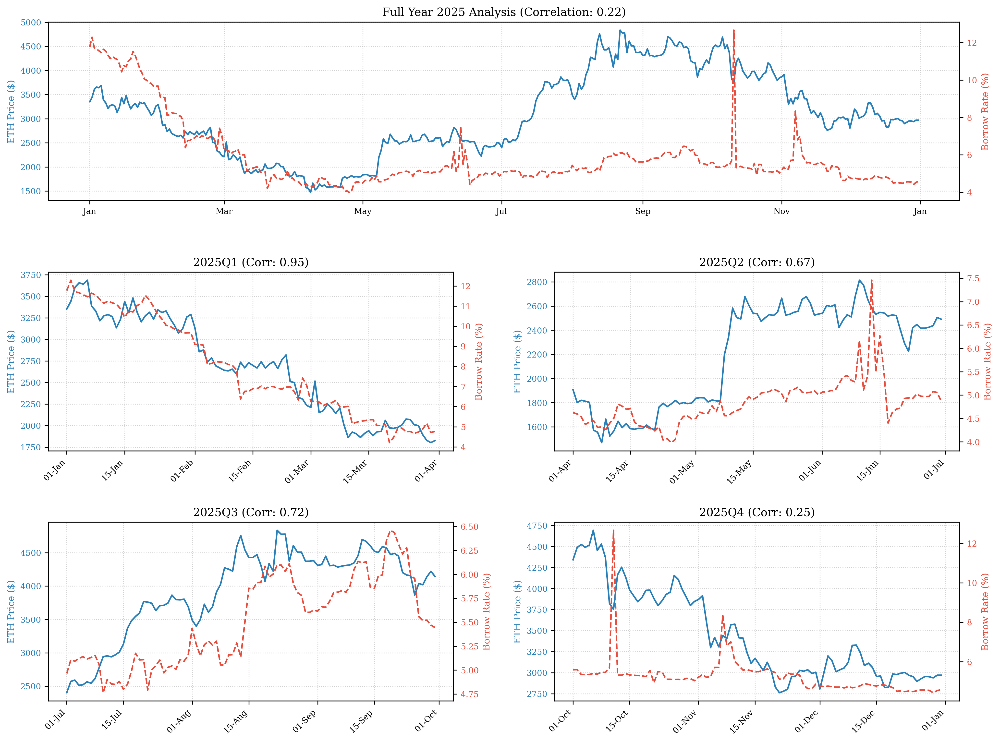

# Rate-Level Perpetuals (RLP)

## Abstract
Traditional Decentralized Finance (DeFi) interest rates are highly volatile, exhibiting algorithmic responses to utilization shocks. Rate-Level Perpetuals (RLP) transform this ephemeral concept of "yield" into a persistent, tradable asset. By indexing a derivative to the borrowing rate of an underlying lending pool, RLP creates a unified primitive for interest rate speculation, hedging, and volatility trading.

## 1. Mechanism Design

The Rate-Level Perp utilizes a Collateralized Debt Position (CDP) architecture inspired by Power Perpetuals (White et al., 2021) and specifically the Squeeth (Squared ETH) implementation by Opyn. This design allows for the creation of a fungible ERC-20 token that tracks the borrowing interest rate of a specific on-chain lending pool (e.g., Aave USDC, Morpho USDT).

### 1.1 The Index Price
The RLP Index Price transforms the instantaneous annualized borrowing rate $r_t$ into a scalar dollar-denominated value:

$$ P_{index}(t) = K \cdot r_t $$

With a constant scalar $K=100$, an interest rate of 5% ($r=0.05$) equates to an index price of $5.00. This linear scalar ensures that derivative payouts are strictly proportional to the underlying rate dynamics; if the interest rate doubles, the fundamental value of the position precisely doubles.

### 1.2 Minting and Short Exposure
Participants seeking to hedge floating-rate assets or speculate on rate mean-reversion interact with the Vault to open Short RLP positions:

1.  **Collateralization**: The user deposits eligible assets (e.g., aUSDC, ETH, sUSDe).
2.  **Minting**: The user mints a quantity $Q$ of RLP tokens, recording a debt as $Q \cdot NF(t) \cdot P_{index}(t)$.
3.  **Liquidation Thresholds**: The Vault enforces over-collateralization parameters - if the debt value exceeds the liquidation threshold (e.g., 109% Collateralization Ratio) due to a severe rate spike, the collateral is auctioned to repay the RLP debt.

This structure creates a fungible asset tracking $P_{index}$ without requiring complex cash-funding machinery, allowing the perpetual to trade on external Automated Market Makers (AMMs) like Uniswap V4.

### 1.3 Continuous Funding via Normalization Factor
Unlike traditional perpetual swaps that require discrete cash payments, RLP employs in-kind funding through a continuously decaying global Normalization Factor ($NF$).

The instantaneous Funding Rate $F$ is a function of the divergence between the secondary market price ($P_{mkt}$) and the fundamental index price:

$$ F = \frac{P_{mkt} - P_{index}}{P_{index}} $$

The Normalization Factor updates continuously to reflect this equilibrium shift:

$$ NF(t+\Delta t) = NF(t) \cdot (1 - F \cdot \Delta t) $$

*   **Premium ($P_{mkt} > P_{index}$):** The Normalization Factor decreases. This amortizes the debt burden for Shorts, effectively transferring value from Longs (who suffer continuous decay) to Shorts.
*   **Discount ($P_{mkt} < P_{index}$):** The Normalization Factor increases. Shorts experience debt inflation, subsidizing Longs to hold the undervalued position.

## 2. Market Microstructure

### 2.1 The Mean-Reversion Advantage on CLAMMs
The Rate-Level Perp utilizes Concentrated Liquidity Automated Market Makers (CLAMMs), specifically Uniswap V4, as its primary trading venue. While the RLP architecture is heavily inspired by Power Perpetuals, it solves their most significant operational limitation: long-term Impermanent Loss (IL) for Liquidity Providers.

**The Divergence Problem in Traditional Power Perpetuals**
Standard power perpetuals tracking directional spot assets (e.g., Squeeth tracking ETH²) face severe liquidity provision challenges. Because asset prices can trend infinitely (e.g., ETH moving from $1,000 to $4,000), LPs providing liquidity against these derivatives suffer continuous divergence loss. The asset rarely mean-reverts to the exact entry price, forcing LPs to dynamically delta-hedge their exposure or accept permanent capital destruction.

**The Structural Bound of Interest Rates**
Interest rates, by contrast, possess an intrinsic structural gravity. They fundamentally cannot trend infinitely. Algorithmic DeFi lending curves enforce strict physical boundaries:
1.  **The Floor:** Rates cannot drop below 0% and typically hover near a practical macroeconomic floor established by the Secured Overnight Financing Rate (SOFR). If DeFi borrowing rates drop below the SOFR yield, institutional arbitrageurs are incentivized to borrow stablecoins on-chain and deploy the capital into tokenized T-Bills to capture the risk-free spread. This arbitrage loop inherently drives borrowing demand back up, cementing SOFR as a structural floor.
2.  **The Ceiling:** Rates are mathematically hard-capped by the protocol's "Slope 2" utilization maximum (e.g., 75% or 100%).

While rates may spike violently during a liquidity crisis (the exact mechanics utilized in our PCDS), economic forces invariably pull them back toward a central equilibrium. Borrowers repay expensive debt, and new suppliers enter to capture high yields, mechanically forcing utilization—and thus the borrowing rate—back to its baseline.

**CLAMM Synergy and the Elimination of Long-Term IL**
This mathematical mean-reversion makes RLP uniquely suited for CLAMMs. Liquidity Providers can deploy capital into highly concentrated, deterministic ranges (e.g., 4% to 15%) without the existential threat of infinite divergence.
*   **Normal Regimes:** The rate oscillates predictably within the concentrated band. LPs act as highly capital-efficient market makers, capturing continuous trading fees with near-zero long-term divergence loss.
*   **Crisis Regimes:** If rates spike out of range, the LP temporarily stops earning fees and holds the underlying tokens. However, unlike a spot asset that may never return, the algorithmic mechanism of the lending pool guarantees that the rate will eventually mean-revert back into the LP's concentrated liquidity band.

By coupling the convex payout structure of a Power Perpetual with the bounded, mean-reverting physics of algorithmic interest rates, RLP creates the first options-like derivative that is structurally safe for passive, unhedged liquidity provision on a CLAMM.

### 2.2 Volatility Trading and Cointegration

While this bounded mean-reversion provides structural safety for CLAMM liquidity providers, it simultaneously creates a powerful synthetic instrument for active speculators. Empirical analysis of DeFi market dynamics establishes a verifiable link: interest rate volatility acts as a leveraged, time-delayed proxy for asset price volatility.

When speculators anticipate directional asset moves, organic demand for leverage rapidly saturates available liquidity. Because DeFi borrowing rates are governed by deterministic algorithmic utilization curves rather than central banks, this demand triggers exponential rate spikes along the curve's "kink." Therefore, taking a Long RLP position effectively captures the implied volatility premiums inherently priced into these reactive algorithmic liquidity pools.

The composite chart below visualizes the exact cointegration breakdown between Chainlink ETH/USD oracle prices and Aave V3 USDC borrow rates across the 2025 market cycle.

#### 2.2.1 Empirical Analysis: Cointegration and Algorithmic Latency

Stochastic analysis utilizing the Engle-Granger methodology confirms that asset prices and DeFi interest rates exhibit regime-specific cointegration. While standard linear correlation often breaks during market shocks, the underlying fundamental force of leverage demand enforces strict mathematical mean-reversion over an identifiable lag window.

**Table 1: 2025 Empirical Market Dynamics and Cointegration Lags**

| **Period** | **Pearson Corr** | **Corr (7D MA)** | **Lag-7 Corr** | **Lag-14 Corr** | **Optimal Coint Lag** | **Min EG p-value** | **Regime Classification** |
| --- | --- | --- | --- | --- | --- | --- | --- |
| Full Year 2025 | 0.217 | 0.228 | 0.287 | 0.316 | 38 days | 0.5415 | Structural Break |
| Q1 2025 | 0.954 | 0.974 | 0.950 | 0.916 | **1 day** | **0.0036*** | Continuous Trend |
| Q2 2025 | 0.671 | 0.842 | 0.643 | 0.597 | 5 days | 0.1769 | Mean-Reverting Chop |
| Q3 2025 | 0.724 | 0.797 | 0.828 | 0.334 | **7 days** | **0.0184*** | Exogenous Shock |
| Q4 2025 | 0.254 | 0.529 | 0.458 | 0.558 | **7 days** | **0.0436*** | Liquidity Crisis |

*(*** *denotes statistical significance at the 5% level or better)*

**Key Empirical Findings:**

1. **Regime-Dependent Equilibrium:** Uniform full-year cointegration is mathematically rejected (p=0.5415 at optimal lag) due to severe mid-year structural breaks. However, isolating the organic trending market of Q1 yields a highly significant minimum p-value of **0.0036** with an optimal lag of just **1 day**. This proves that under continuous macroeconomic phases, interest rates and asset prices share an immediate, tightly bound stochastic drift.
2. **Quantifying Algorithmic Latency (The "Lag"):** The exact latency of the algorithmic interest rate response is strictly regime-dependent. During the strong Q1 trend, the market reprices within 24 hours. However, during the chaotic Q3 and Q4 regimes, the optimal mathematical lag extends precisely to **7 days**, confirming a verifiable time-delay between an initial market shock and the subsequent liquidity repricing.
3. **The Q4 Structural Break Resolution:** The base Q4 data displays a total decoupling (Correlation = 0.254, Lag-0 p-value = 0.4618), triggered by the Stream Finance $93M liquidity hack causing panic withdrawals and artificial rate inflation independent of ETH price action. However, shifting the Engle-Granger test by a 7-day lag restores mathematical significance (**p=0.0436**). This empirically proves that the extreme rate dislocation was fundamentally temporary, and the algorithmic gravity of the lending pool forcibly restored equilibrium exactly 7 days post-shock, offering a highly predictable statistical arbitrage window for RLP shorts.

#### 2.2.2 Monetizing Convexity (The Rate-Asset Straddle)
During parabolic rallies, borrowing rates exhibit **Positive Convexity**, rising exponentially relative to the asset price due to the "kink" in Interest Rate Models.

**Empirical Case Study (Late 2024 Rally):**
*   **Asset Move:** Bitcoin rallied from $60k → $110k (**+83%**).
*   **Rate Response:** USDC borrowing rates surged from 7.6% → 45.5% (**+502%**). The interest rate moved 6x faster than the underlying asset.

Sophisticated actors can monetize this utilizing a delta-neutral **Rate-Asset Straddle**:
*   **Leg 1:** Short BTC-PERP.
*   **Leg 2:** Long RLP-USDC.

In the above melt-up scenario:
*   The Short BTC position suffers a linear loss of **-83%**.
*   The massive demand for leverage drives RLP prices up exponentially, generating a **+502%** return.
*   **Net Outcome:** $(+502\%_{RLP}) + (-83\%_{BTC}) = \mathbf{+419\%}$ Net PnL.

The trader profits massively on a delta-neutral portfolio because the convexity of the rate spike overwhelms the linear loss of the asset. Crucially, this structure is often **Carry Neutral**: in a bull market, Short BTC positions receive massive funding payments from longs, which perfectly offsets the cost of holding the Long RLP leg, allowing the trader to hold this convex hedge with minimal bleed.
