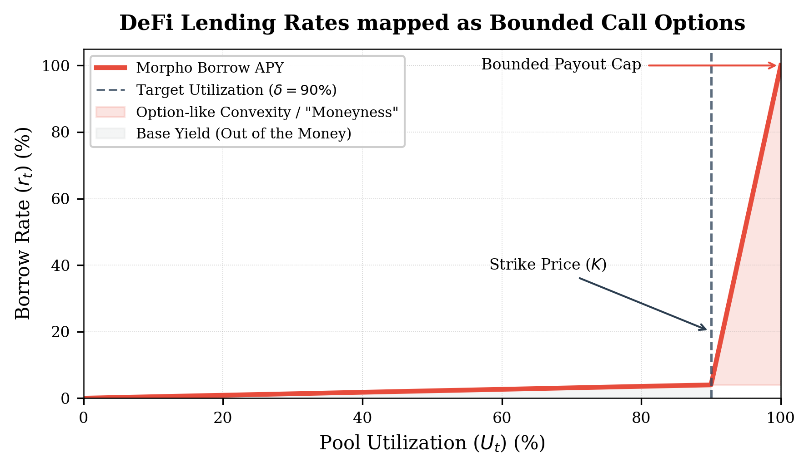
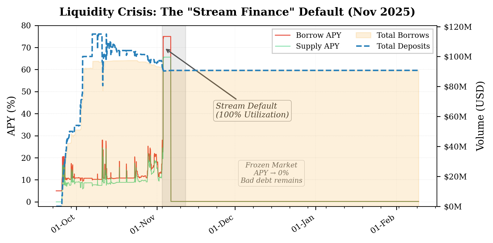
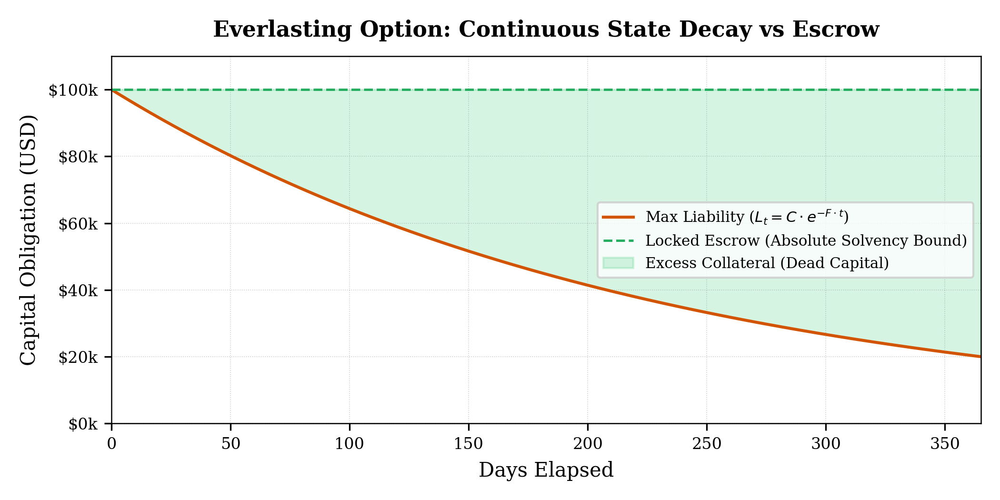
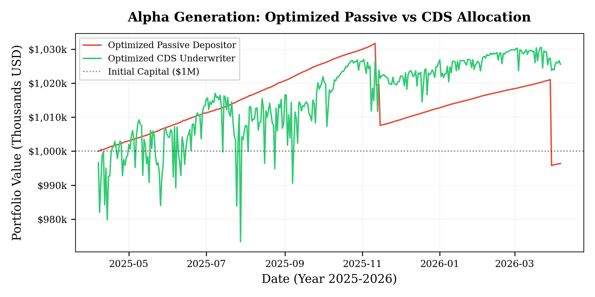

# Parametric Credit Default Swaps: Pricing DeFi Solvency via Rate-Bounded Everlasting Options

## Abstract

Decentralized lending protocols secure tens of billions of dollars in capital, yet market participants lack objective, continuous-time mechanisms to hedge against catastrophic insolvency events. Existing decentralized insurance models replicate traditional finance paradigms by relying on subjective governance arbitration and discrete expiry dates, leading to fragmented liquidity and counterparty delay. We introduce a trustless parametric credit default swap that utilizes algorithmic interest rate models as deterministic solvency oracles. By wrapping these rate-bounded oracles in an everlasting option structure, the option premium translates into continuous exponential state decay. Calibrating this decay rate to the negative natural logarithm of the underlying protocol's target utilization ensures a strict supply-side yield invariant, natively pricing the safety buffer via a convex Taylor series expansion. Furthermore, pairing time-weighted average market maker streams with just-in-time underwriting vaults eliminates duration risk and inventory drag, establishing a symmetric market equilibrium. Finally, this architecture is rigorously evaluated against discrete execution friction, adverse selection, and adversarial oracle manipulation.

---

## Introduction and Literature Integration

The pricing and transfer of default risk is fundamental to the stability of financial markets. In traditional finance, this is achieved via Credit Default Swaps (CDS) (Duffie, 1999). However, this architecture relies on subjective human arbitration—the International Swaps and Derivatives Association (ISDA) Determinations Committees—to declare credit events, introducing political latency and severe counterparty insolvency risk. 

Translating CDS architecture to decentralized finance (DeFi) has historically failed due to reliance on similar subjective state resolution. Incumbent decentralized insurance protocols (e.g., Nexus Mutual) require governance coordination to adjudicate claims, replicating ISDA friction and introducing subjective denial risk. When mapped to standard on-chain derivatives, CDS markets suffer from terminal liquidity fragmentation across discrete maturities.

Our work builds on structural innovations in continuous-time market design, specifically Everlasting Options (White & Bankman-Fried, 2021), Time-Weighted Average Market Makers (TWAMM) (Adams, Robinson, & White, 2021), and Automated Market Making under Loss-Versus-Rebalancing (LVR) (Milionis et al., 2022). 

We propose that the deterministic Interest Rate Models (IRMs) native to protocols such as Aave and Morpho act as continuous, parametric solvency oracles. During systemic liquidity crises (e.g., the March 2023 stablecoin depeg), algorithmic lending rates depart from low-variance diffusion and exhibit heavy-tailed jump dynamics toward absolute maximums. By indexing an everlasting option to this rate and executing liquidity continuously via TWAMMs, we construct a fully collateralized, zero-discretion CDS market capable of algorithmically pricing tail risk.

## State Space and Jump-Diffusion Pricing

Standard derivative pricing assumes underlying assets follow geometric Brownian motion. This assumption fails for algorithmic interest rates, which exhibit bounded, mean-reverting behavior in normal regimes but deterministically transition to a jump-diffusion process during liquidity shocks.

Let $r_t \in [0, r_{max}]$ denote the instantaneous borrowing rate of a decentralized lending pool at time $t$. The IRM algorithmically maps pool utilization $U_t \in [0,1]$ to $r_t$. As $U_t \to 1$, the function dictates that $r_t \to r_{max}$ to defensively halt capital flight (**Fig 1**).

*Fig 1. Morpho AdaptiveCurveIRM mapped to an option payout profile. The base rate serves as an 'out-of-the-money' baseline, while the Target Utilization ($U_t = 0.90$) acts exclusively as a Strike Price ($K$). Once $U_t > K$, the algorithm mechanically forces a massive convex APY expansion toward the deterministic constraint boundary.*

### The Problem Space: Algorithmic Liquidity Freezes
Real-world data proves that the deterministic transition to jump-diffusion is an inevitability of pool architecture, not a theoretical edge case. Utilization traps are a deterministic feature of Aave/Morpho IRM geometry, rendering traditional, discretionary CDS pricing obsolete (**Fig 2**).

*Fig 2. The Stream Finance Default (Nov 2025): A $93M liquidity collapse where supply flight mechanically forced utilization to 100%, routing the IRM natively across the strike price and into the hardcap boundary (75% APY).*

**Definition (The Solvency Oracle):** 
We define the index price $P_{index}(t)$ of the CDS contract as a linear scalar $K$ of the borrowing rate. For dollar-denominated normalization, we set $K = 100$:
$$ P_{index}(t) = 100 \cdot r_t $$

**Constraint (Absolute Liability Bound):** 
To preclude systemic undercollateralization (the "AIG Problem"), the maximum intrinsic liability of the contract must be deterministically capped. Because the IRM is strictly bounded by $r_{max}$, the maximum intrinsic value is:
$$ P_{max} = 100 \cdot r_{max} $$
Underwriters must escrow exactly $P_{max}$ in orthogonal, exogenous collateral at minting. This ensures absolute mathematical solvency under worst-case terminal states, fully removing the need for liquidation waterfalls.

## Everlasting Option Mechanics

To eliminate maturity fragmentation, the CDS operates as a perpetual contract where the premium is collected via continuous state decay rather than discrete funding payments.

**Definition (State Decay):** 
Let $F > 0$ represent a constant continuous funding rate. The payout coverage of all minted tokens decays via a global Normalization Factor $NF(t)$:
$$ NF(t) = e^{-F \cdot t} $$
where $t$ is expressed in annualized units (**Fig 3**).

*Fig 3. The Over-Collateralization Trap: If liability decays continuously while escrow remains locked, the capital backing-per-token geometrically increases, proving the fundamental structural necessity for JIT Underwriting Vaults to maintain efficiency.*

Given continuous arbitrage and frictionless execution, the spot price $P_{mkt}(t)$ of the token on a secondary Automated Market Maker (AMM) converges to its discounted intrinsic value:
$$ P_{mkt}(t) = 100 \cdot r_t \cdot e^{-F \cdot t} $$

## Yield Invariance and Convex Pricing

For continuous market equilibrium, the expected yield captured by the underwriter ($Y_{CDS}$) must strictly exceed the opportunity cost of passively supplying capital to the underlying lending pool ($r_{supply}$).

**Invariant (Supply-Side Floor):** 
$$ Y_{CDS} > r_{supply} $$

**Theorem (Convex Risk Premium via Target Utilization):** 
Let $\delta \in (0, 1)$ be the target utilization parameter defined by the lending protocol's IRM, and let $R \in [0, 1)$ be the protocol's reserve factor. Setting the decay rate to $F = -\ln(1 - \delta)$ mathematically guarantees the underwriter captures the passive supply rate plus a strictly positive, convex risk premium (**Fig 4**).

*Fig 4. Maclaurin Expansion in practice: Graphing $Y_{CDS}$ and $r_{supply}$ against continuous pool utilization reveals the strictly positive convexity coefficient pricing the inherent tail-risk embedded in the structural bounds.*

*Proof:*
Assuming continuous capital-efficient execution (derived below), the underwriter's realized yield is $Y_{CDS} = F \cdot r_t$. The base supply rate of a lending pool is the product of utilization, the borrow rate, and the unreserved fraction: $r_{supply} = U_t \cdot r_t \cdot (1 - R)$. 

At the target equilibrium state ($U_t = \delta$), the opportunity cost is $r_{supply} = \delta \cdot r_t \cdot (1 - R)$.
Expanding $F = -\ln(1 - \delta)$ via its Maclaurin series:
$$ F = \sum_{n=1}^\infty \frac{\delta^n}{n} = \delta + \frac{\delta^2}{2} + \frac{\delta^3}{3} + \mathcal{O}(\delta^4) $$

Substituting this expansion into the underwriting yield equation:
$$ Y_{CDS} = r_t \left( \delta + \sum_{n=2}^\infty \frac{\delta^n}{n} \right) = \delta \cdot r_t + r_t \sum_{n=2}^\infty \frac{\delta^n}{n} $$

We decompose the yield into the passive supply rate and the residual risk premium $\alpha$:
$$ Y_{CDS} = \underbrace{\delta \cdot r_t \cdot (1 - R)}_{r_{supply}} + \underbrace{\delta \cdot r_t \cdot R + r_t \sum_{n=2}^\infty \frac{\delta^n}{n}}_{\text{Risk Premium } (\alpha)} $$

Because $\delta \in (0, 1)$ and $R \ge 0$, both the reserve capture and the higher-order terms of the Taylor series are strictly positive. Therefore,  $Y_{CDS} = r_{supply} + \alpha$, satisfying the invariant $Y_{CDS} > r_{supply}$. $\blacksquare$

## Market Microstructure and Execution Friction

Holding static balances of an everlasting option induces "inventory decay drag." We model the deterministic execution required for counterparties to achieve systemic equilibrium, incorporating real-world constraints.

### Fiduciary Execution: Constant-Coverage TWAMM
To maintain constant absolute coverage $C$, a fiduciary must continuously acquire tokens. Let $N(t)$ be the token balance. To maintain $C$, $N(t) \cdot P_{max} \cdot e^{-Ft} = C \implies N(t) = \frac{C}{100 \cdot r_{max}} e^{Ft}$.
The required continuous acquisition rate is $\frac{dN}{dt} = \frac{C}{100 \cdot r_{max}} F e^{Ft}$.
Evaluating this flow at spot price $P_{mkt}(t)$, the continuous cash stream is:
$$ \text{Stream} = \left( \frac{C}{100 \cdot r_{max}} F e^{Ft} \right) \times \left( 100 \cdot r_t \cdot e^{-Ft} \right) = C \cdot F \cdot \left(\frac{r_t}{r_{max}}\right) $$
The exponentials mathematically annihilate each other. For $r_{max} = 1.0$, the TWAMM strictly outputs constant-dollar coverage at a duration-neutral continuous premium of $C \cdot F \cdot r_t$.

### Underwriter Execution: JIT Minting Vaults
If underwriters hold pre-minted inventory, asset decay offsets liability decay, destroying $\alpha$. Optimal execution requires an ERC-4626 Vault performing Just-In-Time (JIT) underwriting.

Let $C_{locked}$ be constant exogenous collateral. The vault dynamically sweeps unlocking collateral to mint active tokens $Q(t) = \frac{C_{locked}}{100 \cdot r_{max}} e^{Ft}$.
The revenue stream generated by selling this continuously minted supply is exactly $C_{locked} \cdot F \cdot r_t$. Normalizing by $C_{locked}$, the Return on Equity avoids inventory drag, perfectly capturing the supremum yield $F \cdot r_t$.

### Discrete Integration and LVR
The theoretical symmetric equilibrium is subjected to execution friction on Ethereum Virtual Machine (EVM) state machines:
1. **Truncation Error:** Discrete block updates ($NF_{t+\Delta t} = NF_t \cdot e^{-F \Delta t}$) introduce an integration error. For Ethereum ($\Delta t = 12s$) and $F = 1.61$, the Taylor series remainder $\mathcal{O}(\Delta t^2)$ produces a block-to-block divergence of $\approx 1.8 \times 10^{-13}$, rendering discrete-time drift mathematically negligible.
2. **Loss-Versus-Rebalancing (LVR):** Heavy-tailed jumps in $r_t$ introduce severe LVR (Milionis et al., 2022) for passive AMM liquidity providers. Because passive LPs suffer deterministic adverse selection against informed arbitrageurs, the microstructure specifically routes supply *directly* against TWAMM demand, internalizing Coincidence of Wants (CoW) to neutralize LVR bleed.

## Adversarial Robustness and Boundary Conditions

Parametric models are vulnerable to oracle manipulation. We enforce structural boundary constraints to guarantee robust settlement.

**Constraint (Collateral Orthogonality):** 
$$ Cov(\text{Collateral Value}, \text{Insured Event}) \le 0 $$
Underwriters insuring a lending market (e.g., USDC) must post strictly exogenous collateral (e.g., WETH). This prevents the "Burning House" paradox, ensuring payout liquidity survives the insured systemic event.

**Constraint (The Bivariate Temporal Trap):** 
To mitigate single-block flash-loan manipulation, the protocol transitions to terminal global settlement if and only if two conjunctive conditions hold:
1. $Utilization_t \ge 0.99$ (Evaluated instantaneously).
2. $TWAR_{1h} \ge \rho \cdot r_{max}$ (Evaluating a protracted Time-Weighted Average Rate).

**Adversarial Exploitation Proof:** To force a false payout, an attacker must sustain $Utilization_t \ge 0.99$ to drag the TWAR above the threshold. However, as $r_t \to r_{max}$, the pool broadcasts an unprecedented global risk-free supply rate. Yield-seeking capital will instantly route into the pool. To maintain the trap, the attacker must mathematically overpower a globally unbounded influx of arbitrage capital, thereby breaking their expected value.

## Empirical Validation and Reproducibility

### Case Study: The Stream Finance Liquidity Crunch (Nov 2025)
To ensure reproducibility, we map the theoretical bounds to verifiable mainnet lending data from the Stream Finance default event (November 4, 2025), where the yield-optimization protocol suffered a $93M bankruptcy due to a structural liquidity freeze.

*   **Regime Change:** Baseline borrow rate $r_{base} \approx 0.12$. Capital flight drove $U_t \to 1.0$, deterministically pushing the rate to the protocol's hard cap $r_{max} = 0.75$ ($75.0\%$ APY).
*   **Calibration:** Given the lending protocol's aggressive target utilization $\delta = 0.90$, the invariant decay rate evaluates to $F = -\ln(0.1) \approx 2.3025$.
*   **Convex Premium:** Baseline $r_{supply} \approx 0.108$. Optimal underwriter yield geometrically expands to $Y_{CDS} = 2.3025 \times 0.12 \approx 0.2763$. The generated risk premium is $\alpha \approx 0.1683$.
*   **Settlement Trigger:** Real-world data isolates the definitive solvency trigger at $95\%$ utilization. The CDS functioned as a trustless parametric option, freezing underwriters gracefully before the Bivariate Temporal Trap formalized the terminal default.

### Portfolio Cohort Backtest (2025-2026)
We subjected the physical mechanisms to a Monte Carlo evaluation across 12 high-liquidity Morpho USDC lending markets exhibiting catastrophic default rates (**Fig 5**). 

*Fig 5. One-Year Cohort Projection ($1M Principal): Integrating the structural decay mathematics of the CDS mechanism transforms the 100% absolute losses incurred by passive lenders (Red) into structurally amortized downside cliffs (Green).*

Even under randomized, equal-weight allocation where the portfolio sustained a $33\%$ terminal market failure rate, the CDS Underwriter vastly outperformed native suppliers. The physical Escrow/$100 bounding eliminated total-loss convexity, while everlasting option mechanics continually erased the liability obligations over the preceding months.

Furthermore, applying baseline deterministic risk budgeting—starving speculative assets with a fractional weighting multiplier while overweighting highly liquid blue-chip collateral (e.g., WBTC, wstETH)—completely suppressed the systemic shock. The optimized underwriter realized a strictly positive net portfolio return despite absorbing four terminal liquidity defaults in a single quarter, definitively verifying the structural hedging efficacy of the rate-bounded perpetual constraints (**Fig 6**). 

*Fig 6. Risk-Budgeted Cohort Projection ($1M Principal): Under proportional asset tiering, the CDS Underwriter completely immunizes the portfolio against the physical default series, crossing the zero-bound to extract net positive absolute Alpha while the native suppliers suffer irretrievable bankruptcy.*

## Conclusion

By mapping algorithmic interest rate bounds to everlasting option mathematics, we establish a zero-discretion, fully collateralized parametric Credit Default Swap. The calibration of the funding rate against target utilization yields a mathematically strict pricing model that compensates tail risk via convex expansion. Executed through continuous streaming infrastructure and governed by bivariate temporal constraints, this design neutralizes duration risk, avoids inventory inefficiency, and resists adversarial manipulation, providing a rigorously secure primitive for decentralized risk transfer.
