# The rsETH Exploit and the Case for Interest Rate Markets

*A forensic analysis of how a $290M bridge exploit froze $20B in Aave lending markets — and why on-chain interest rate swaps are the missing stabilizer.*

> **Data sources:** On-chain Aave V3 Core event data, Galaxy Research block-level analysis, Aave governance forum.
> **Window:** April 18 17:38 UTC (block 24908299) → May 8, 2026.

---

## Executive Summary

On April 18, 2026 at 17:38 UTC, an attacker exploited KelpDAO's rsETH bridge — a single-validator (1-of-1 DVN) LayerZero configuration — to unlock 116,500 rsETH from the Ethereum mainnet escrow. The stolen tokens were deposited as collateral on Aave, against which the attacker borrowed 52,441 WETH (~$290M). This triggered the largest liquidity crisis in DeFi history: a cascading bank run that cut Aave V3 Core's TVL nearly in half.

**Key figures (from Galaxy Research + our data):**

| Metric | Value |
|--------|-------|
| Exploit size | $290M (116,500 rsETH) |
| Bad debt accrued | ~$123M |
| Time to WETH 100% utilization | **2 hours 16 minutes** |
| WETH time at >99% utilization | **12.7 days** |
| Total stablecoin outflow (6h) | 1.815B units (−17.0%) |
| Total stablecoin outflow (2wk) | 5.504B units (−51.7%) |
| WETH supply drawdown | 3.01M → 2.06M (−31.4%) |
| Protocol TVL (net) | $20.7B → $11.3B (−45.3%) |
| Total supply drawdown | $34.4B → $20.4B (−40.9%) |
| DeFi United backstop raised | $300M+ |

The protocol's response relied entirely on governance-mediated interventions: manual IRM parameter adjustments (WETH Slope 2 lowered on April 20), contested forum proposals (USDC Slope 2 increase debated April 22–23), and emergency capital fundraising (DeFi United's $300M+ backstop). Each of these mechanisms required multi-day coordination, produced asymmetric outcomes across borrower classes, and generated legal liability from affected users.

**An on-chain interest rate swap (IRS) market would have replaced this governance-dependent response with free-market rate discovery.** Rate short sellers — traders who lock elevated crisis rates expecting mean reversion — would have entered positions immediately after the spike, providing three stabilizing forces absent today: (1) a visible term structure pricing the market's expectation of crisis duration, (2) opposing capital flow against the panic exit, and (3) individual hedging instruments that let rate-sensitive borrowers stay in the pool rather than flee. The data shows USDT rates spiked to 14% (from a 3.4% baseline) and remained elevated for 461 hours — a bounded, calculable, asymmetric payoff for short sellers whose downside is capped by Aave's own IRM parameters. Instead of waiting weeks for governance to decide who bears the cost, an IRS market would price and distribute that cost in real time.

---

## 1. Root Cause

```
KelpDAO rsETH
    └── LayerZero OFT bridge (Ethereum ↔ other chains)
        └── 1-of-1 DVN configuration (single validator)
            └── Validator compromised → 116,500 rsETH unlocked from escrow
                └── Deposited on Aave as collateral (95% LTV)
                    └── Borrowed 52,441 WETH across 4 transactions
```

> [!CAUTION]
> rsETH was listed on Aave V3 Core at **95% LTV** without auditing the bridge infrastructure supporting the asset. The 1-of-1 DVN configuration — where a single validator failure unlocks the entire escrow — represents a catastrophic single point of failure that should have been caught during onboarding. This was highlighted by governance forum participant **evva**: *"Aave's onboarding process listed rsETH at 95% LTV without auditing the bridge infrastructure."*

---

## 2. The Three-Phase Cascade

### Phase 1: WETH Freeze (Hours 0–6)

The exploit triggered an immediate bank run on the WETH pool. Suppliers rushed to withdraw, pushing utilization from ~88.6% to 100% in **2 hours 16 minutes** (678 blocks). Once WETH hit 100% utilization, no further withdrawals were possible — the pool was frozen.

- 325,370 WETH net withdrawn (−10.82% of supply)
- The exploiter's 52,441 WETH borrows initially *increased* total borrows
- Backing out the exploiter: 34,866 WETH of organic borrows closed

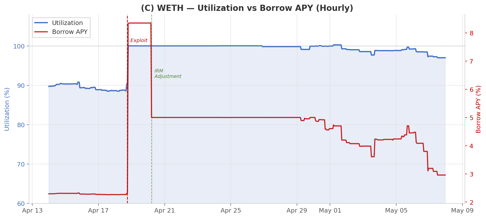

**April 20, 05:00 UTC — Governance intervention:** Risk curators lowered WETH Slope 2 (from >6% to ~5% borrow APY) and raised UOptimal from 85% to 94%. This reduced the punitive cost of borrowing but did not restore withdrawals — utilization remained pinned at ~100%.

### Phase 2: Stablecoin Synthetic Exit Squeeze (Hours 6–48)

With WETH frozen, trapped suppliers adopted a **synthetic exit strategy**: borrow stablecoins against their frozen WETH collateral to extract value. This was not organic stablecoin demand — these were rate-insensitive borrowers performing emergency capital extraction.

The result: stablecoin utilization spiked toward 100% in sequence:

| Asset | Time to >99% Utilization | Hours at >99% |
|-------|--------------------------|---------------|
| WETH | 2h 16m | **304.8h** (12.7 days) |
| USDT | 8h 24m | 135.19h |
| USDC | 11h 49m | 97.82h |
| PYUSD | 13h 23m | 2.77h |
| USDe | 19h 04m | 70.48h |
| DAI | 42h 39m | 15.82h |

*Source: Galaxy Research, 100-block moving average.*

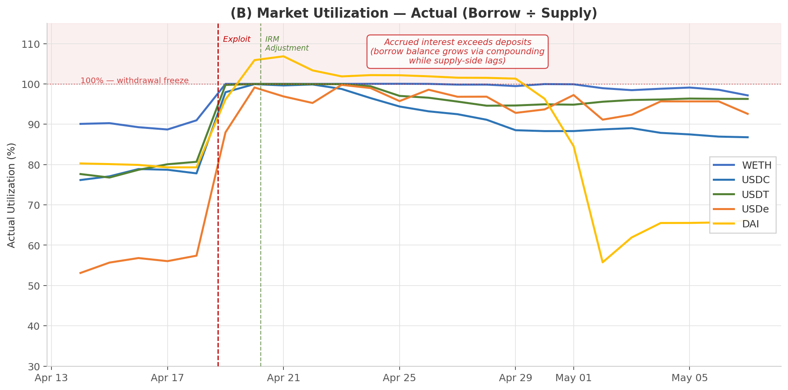

Note: DAI utilization briefly exceeds 100%. This occurs because borrow balances compound via accrued interest while supply-side accounting lags — the outstanding debt grows faster than the recorded deposit base. This is a direct consequence of elevated borrow rates persisting at maximum utilization: at ~112% borrow-to-supply, the pool is not only frozen but actively accruing unfunded liabilities.

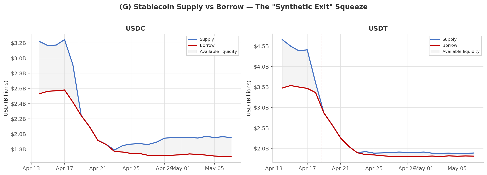

The USDC chart above shows the classic "synthetic exit" pattern: supply collapses while borrow declines more slowly, compressing available liquidity to near-zero. The gray shaded area — available liquidity — effectively vanishes by April 20.

### Phase 3: Liquidation Wave (Days 3–7)

As elevated borrow rates accrued on trapped positions, health factors degraded and liquidations cascaded — peaking on April 23 with 48 events (12× baseline).

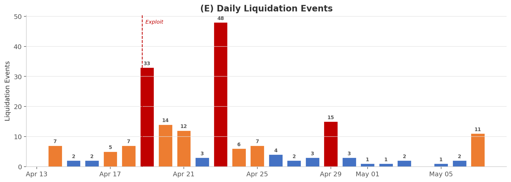

> [!WARNING]
> **The liquidation paradox (from ChaosLabs):** WETH-collateralized positions were effectively **non-liquidatable**. A liquidator calling `liquidationCall` on a WETH-backed USDC position would receive WETH as seized collateral — but cannot withdraw it (100% utilization). The liquidator inherits the same trapped position. This made liquidation "highly unappealing" and allowed bad debt to accrue.

---

## 3. Protocol-Wide Impact

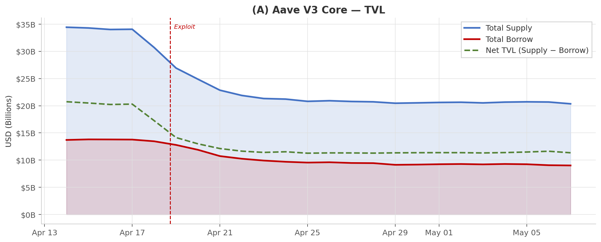

### Supply Flight by Asset Class (Galaxy Research)

| Asset Class | 6h Outflow | 2-Week Outflow |
|-------------|-----------|----------------|
| Stablecoins | 1.815B units (−17.0%) | 5.504B units (−51.7%) |
| WETH | 325,370 units (−10.82%) | 943,327 units (−31.4%) |
| Bitcoin (cbBTC+WBTC+LBTC+tBTC) | 8,612 units (−12.04%) | 25,450 units (−35.59%) |

### ETH-Correlated Collateral Drawdown

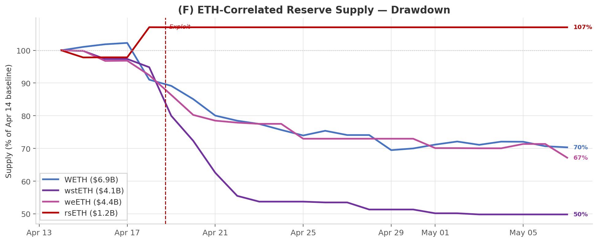

**rsETH supply froze completely** from April 22 onward — zero on-chain activity, $1.28B immovable. Meanwhile, wstETH (−51%), weETH (−33%), and WETH (−30%) experienced massive withdrawals as users with *those* collateral types exited.

### Borrow Rate Stress

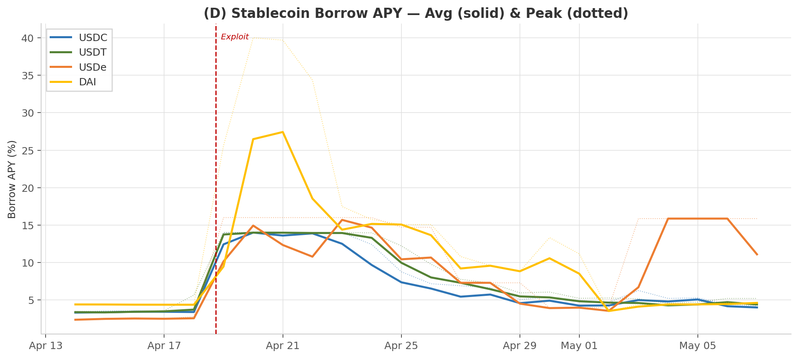

---

## 4. Structural Vulnerability: E-Mode Leverage Concentration

Galaxy Research's snapshot at block 24932111 (April 22) revealed the structural fragility that made this cascade possible:

| Metric | All Positions | E-Mode | Vanilla |
|--------|--------------|--------|---------|
| Outstanding debt | $10.7B | $6.3B (58.84%) | $4.4B |
| Debt/Collateral ratio | 61.65% | **89.4%** | 42.7% |
| Debt-weighted LTV | — | **~90%** | ~47% |
| Debt-weighted Health Factor | — | **~1.05** | ~1.88 |
| Debt-to-Equity | — | **~10.4** | ~1.0 |

### Collateral Concentration

E-mode collateral is overwhelmingly ETH-correlated:

| Asset | Share of E-Mode Collateral |
|-------|--------------------------|
| weETH | **~48%** |
| rsETH | ~16% |
| wstETH | ~16% |
| **Top 3 combined** | **~80%** |

### Borrow Concentration

| Asset | Share of E-Mode Borrows |
|-------|------------------------|
| WETH | **~85%** |
| USDT + USDC + USDe | ~15% |

> [!IMPORTANT]
> **The depeg sensitivity cliff:** A 10% weETH depeg would leave $2.47B in debt against $2.42B in post-shock collateral — the basket goes **underwater**. Between 3% and 5% depeg, stressed debt jumps from ~$1.6B to ~$2.1B, revealing a cluster of highly leveraged positions that trigger in that narrow band.

---

## 5. Governance Response: The Rate Asymmetry Debate

### Timeline of Actions

| Date | Action | Effect |
|------|--------|--------|
| **Apr 6** | Chaos Labs offboarded; Risk Oracles sunset, keys rotated to Aave Labs + LlamaRisk | Protocol entered crisis without its primary risk manager |
| **Apr 18 17:38** | rsETH exploit at block 24908299 | Cascade begins |
| **Apr 19 02:15** | `CollateralConfigurationChanged` event (1 config change) | Likely rsETH freeze |
| **Apr 20 05:00** | WETH IRM adjustment: Slope 2 lowered, UOptimal raised to 94% | WETH borrow APY drops from >6% to ~5% |
| **Apr 22–23** | Governance forum debate on USDC Slope 2 increase to 40–50% | **Contested** |

### The ChaosLabs Counterargument

ChaosLabs (offboarded but still commenting) argued against raising USDC Slope 2. Their reasoning, validated by our data:

**1. Concentrated non-liquidatable borrower base.** Rate increases would clear healthy borrowers first, leaving only trapped WETH-collateral positions — the most rate-insensitive and non-liquidatable. The USDC market would accumulate bad debt from a fundamentally healthy starting position.

**2. Withdrawal queue absorption.** Any new supply attracted by higher rates would be immediately absorbed by locked suppliers waiting to exit. The pool would briefly dip below 100%, trigger a wave of exits, and re-pin.

**3. Collateral damage to yield strategies.** sUSDe and similar yield-bearing stablecoin positions — already unprofitable at current rates — would face forced unwinds at distressed prices. The resulting demand destruction would reduce structural USDC borrowing long-term.

### The Affected Borrower Perspective

Forum user **evva** raised the asymmetry directly:

> *"On April 20, the DAO lowered WETH borrow rates (Slope 2 → 3%) to protect looper positions against cascade liquidations. The current proposal would raise USDC Slope 2 to 40–50%, forcing the cost of the rsETH incident onto a group of users (USDC borrowers) who had no role in the incident."*

This creates a formal governance liability — **evva** explicitly placed the DAO on notice under tort doctrine, citing the pending class action against Circle (Gibbs Mura, filed April 14, 2026).

---

## 6. Rate-Sensitive Behavioral Shift After the Forum Debate

The April 22–23 governance forum thread — including posts by ChaosLabs, evva, GordonLiao, and Yevhen — marked a visible inflection point in on-chain behavior.

### Transaction Flow Analysis

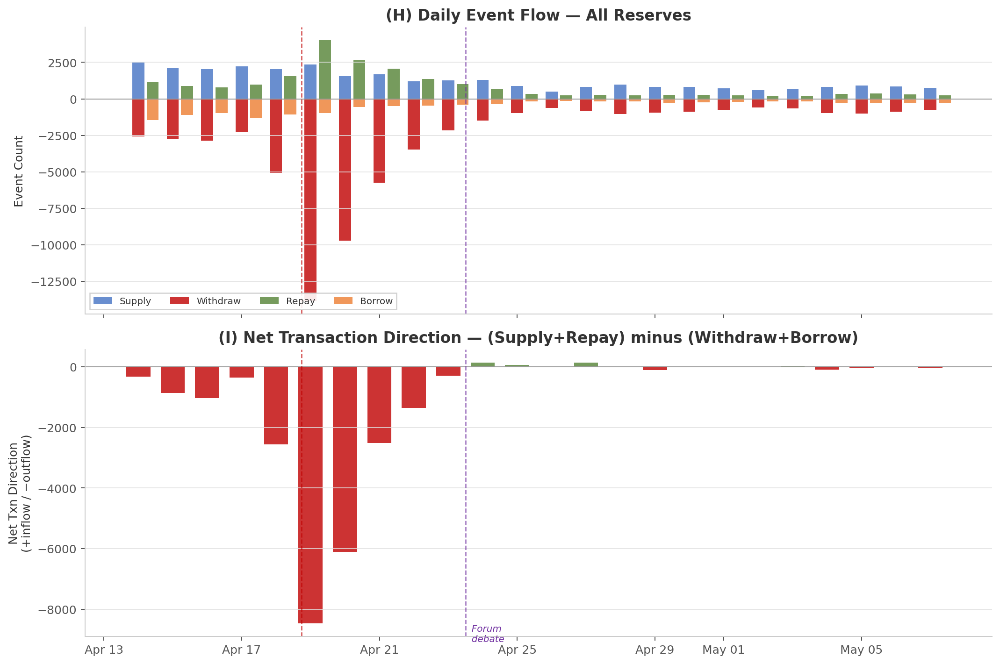

The data shows three distinct behavioral regimes:

| Period | Daily Withdrawals | Daily Repays | Repay/Borrow Ratio | Net Direction |
|--------|-------------------|--------------|---------------------|---------------|
| **Pre-exploit** (Apr 14–17) | 2,609 | 958 | ~0.8 | Net outflow (mild) |
| **Panic** (Apr 18–22) | 7,571 | 2,322 | **2.27** | Net outflow (severe) |
| **Post-forum** (Apr 23+) | 879 | 314 | **1.41** | Near-equilibrium |

The panic window (April 18–22) is dominated by a **massive withdrawal spike** — April 19 alone saw 13,842 withdrawals (5.3× normal). Repays also surged to 4,008, indicating some users were actively deleveraging.

The critical inflection occurs **on April 23**, the day of the ChaosLabs response and Yevhen's post. The net transaction direction flips from deeply negative to approximately zero. By April 24–25, the protocol enters a low-activity equilibrium: far fewer transactions on both sides, with supply and demand roughly balanced. The bank run was over.

> [!NOTE]
> The Repay/Borrow ratio shifted from 2.27 (Apr 18–22) to 1.41 (Apr 23+). The elevated ratio during the panic window confirms rate-sensitive users were aggressively deleveraging. The ratio's decline post-forum suggests the remaining borrower base consists of rate-insensitive participants — exactly the "trapped WETH borrowers doing synthetic exits" that ChaosLabs described.

### Utilization Recovery Timeline

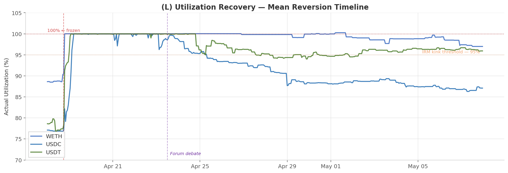

Stablecoin utilization began dropping from 100% on April 23–24 — coincident with the forum debate. USDC and USDT started their descent first, while WETH remained pinned at ~100% until approximately April 28, when it finally began a slow grind down to ~87% by May 7.

This divergence confirms the ChaosLabs thesis: stablecoin markets were self-correcting once the panic subsided (rate-sensitive users left, remaining supply/demand equilibrated), while WETH remained structurally frozen because utilization was driven by trapped collateral, not rate dynamics.

---

## 7. How Interest Rate Swaps Would Stabilize This Crisis

The rsETH exploit exposed a fundamental gap: **Aave's Interest Rate Model (IRM) is a static curve that cannot differentiate between organic demand and crisis-driven rate spikes.** An interest rate swap (IRS) market would have introduced a stabilizing counterparty — the rate short seller — who profits from exactly the conditions that make this crisis painful.

### The IRS Short Seller's Asymmetric Payoff

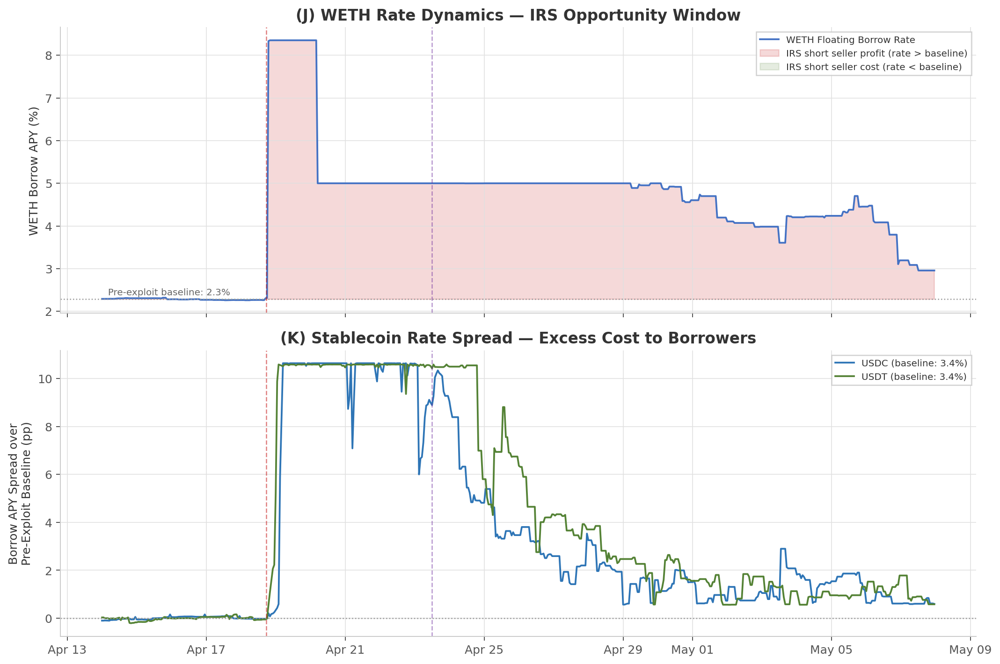

The shaded area in Chart J quantifies the opportunity. A rate short seller (fixed-rate receiver) who entered on April 18 would lock the prevailing high floating rate as their income stream while paying the lower fixed leg. Their thesis: **rates must mean-revert because:**

1. **IRM parameters bound the upside.** Aave's Slope 2 defines the maximum rate at any utilization level. Even at 100% utilization, the borrow rate is capped by the IRM curve parameters — it cannot go to infinity. Post the April 20 adjustment, WETH borrow rate was bounded at ~5%. This caps the short seller's maximum funding cost.

2. **Mean reversion is structurally guaranteed.** Utilization *must* decline eventually: positions get liquidated, loopers unwind via the ETH unstaking queue (~530,249 ETH entered the queue per Galaxy), and DeFi United's $300M backstop injects fresh capital. The only question is *when*, not *if*.

3. **The payoff is asymmetric.** The short seller's downside is bounded (max rate × duration). Their upside is the entire spread between the crisis rate and the eventual normalized rate — which from our data was substantial:

### Quantified IRS Opportunity

| Asset | Pre-Exploit Median Rate | Crisis Avg Rate | Peak Rate | Excess Spread | Hours Elevated |
|-------|------------------------|-----------------|-----------|---------------|----------------|
| WETH | 2.28% | 4.87% | 8.35% | **+2.59pp** avg | 462 hours |
| USDC | 3.36% | 7.43% | 14.00% | **+4.07pp** avg | 461 hours |
| USDT | 3.42% | 8.24% | 14.00% | **+4.82pp** avg | 461 hours |

A USDT rate short seller locking the ~14% crisis rate on April 19 and paying floating would have earned the spread as rates normalized back toward 3.4% over the subsequent 3 weeks. On a $100M notional, that's approximately **$920K in profit** over the 461-hour window ((14% - 3.4%) × $100M × (461/8760)).

### Why Short Sellers Create Stabilization

The presence of IRS short sellers would introduce three stabilizing forces absent from today's market:

**1. Price discovery during crisis.** The IRS term structure would reveal the market's collective expectation of crisis duration. If the 1-week fixed rate trades at 12% but the 1-month trades at 6%, the market is signaling it expects normalization within 2 weeks. This information is currently invisible — governance participants are debating rate changes in a forum with no market signal.

**2. Opposing flow against the panic.** Rate short sellers are the natural counterparty to panicking borrowers. When borrowers see rates spike and rush to repay (adding to the exit stampede), short sellers see the same spike and enter positions that *bet against* sustained elevation. This creates opposing order flow that dampens the magnitude of rate dislocations.

**3. Decoupled risk hedging.** Today, a USDC borrower's only options during a crisis are: (a) repay and exit, or (b) endure the elevated rate. An IRS market adds option (c): buy fixed-rate protection (go long on a swap) to cap your effective borrow cost. This means rate-sensitive borrowers — the healthy positions ChaosLabs wanted to protect — can stay in the pool while hedging their rate exposure. Fewer exits → less utilization pressure → faster normalization. The exact dynamic the governance forum was trying to achieve through manual IRM adjustment.

### The Funding Rate Mechanic

During the crisis, the IRS funding rate would be extremely elevated — reflecting the gap between floating rates (14% for stablecoins) and the market's expected future rate. Short sellers pay this high funding rate in exchange for locking the high fixed income stream. This is the "price of the trade."

The critical insight: **the funding rate is bounded because the underlying IRM rate is bounded.** Unlike a perpetual futures funding rate on a volatile asset (which can spike to any level), the IRS funding rate is mechanically capped by Aave's Slope 2 parameter. This makes the trade calculable:

```
Max short seller loss = (Slope 2 max rate − expected normalized rate) × notional × duration
```

For WETH with Slope 2 = 3% (post-adjustment) and expected normalized rate = 2.3%:
- Max loss per hour of delay = 0.7% × notional / 8760 ≈ 0.008% of notional per hour
- Over 12.7 days (304.8h): 0.008% × 304.8 ≈ 2.44% of notional — bounded, calculable, hedgeable

### Counterfactual: What If IRS Had Existed on April 18?

```
┌─────────────────────────────────────────────────────────────────────┐
│                    WITHOUT IRS (actual)                              │
│                                                                     │
│  Exploit → WETH 100% → Stablecoin flight → Rate spike → Forum     │
│  debate → Manual IRM adjustment → 12.7 days frozen → Slow thaw    │
│                                                                     │
│  Result: Rates set by governance vote. No market signal.            │
│          Asymmetric treatment (WETH rates lowered, USDC raised).    │
│          Legal threats from affected borrowers.                     │
│          $123M bad debt, 3+ weeks to begin normalizing.             │
└─────────────────────────────────────────────────────────────────────┘

┌─────────────────────────────────────────────────────────────────────┐
│                    WITH IRS (counterfactual)                         │
│                                                                     │
│  Exploit → WETH 100% → Rate spike → IRS short sellers enter →     │
│  Term structure reveals expected crisis duration →                  │
│  Rate-sensitive borrowers hedge via long IRS positions →            │
│  Fewer exits (hedged borrowers stay) → Utilization pressure         │
│  reduced → Faster organic normalization                             │
│                                                                     │
│  Result: Rates set by market. Duration priced by term structure.    │
│          Borrowers hedge individually. No governance intervention.   │
│          Short sellers provide stabilizing capital flow.             │
│          Crisis resolves faster through market mechanics.            │
└─────────────────────────────────────────────────────────────────────┘
```

---

## 8. The Structural Case: Why DeFi Needs Rate Markets

The rsETH crisis is not an edge case — it is the inevitable outcome of a system where interest rate risk cannot be managed. To understand why, consider what DeFi lending markets actually are today, and who uses them.

### Looping Is the Primary Use Case

58.84% of Aave's $10.7B in outstanding debt sits in E-Mode, where the debt-weighted leverage ratio is ~10.4× and the average health factor is 1.05. These are not casual borrowers — they are leveraged loopers running ETH-correlated collateral against WETH borrows to amplify yield. Looping is not a niche strategy; it is the dominant use case of DeFi lending.

These users are running a trade. Their returns are contingent on execution, active management, and tight spread control — the same operational demands as any leveraged trading desk. When borrow rates spike from 2.3% to 8.35% in two hours, a looper's entire P&L collapses. A borrower running a strategy with BTC collateral and stablecoin debt deployed to an uncorrelated yield source cannot tolerate borrow-rate volatility eating into thin spreads. Without a hedge, their only option is to unwind — adding to the exact exit stampede that caused the spike.

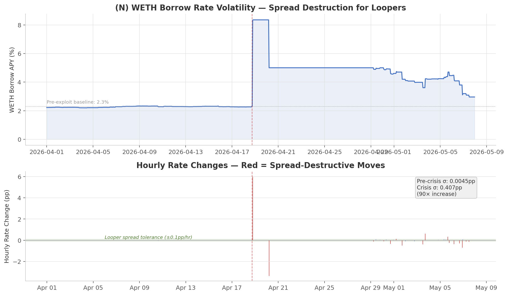

The data makes the case viscerally: WETH hourly rate volatility increased **90×** during the crisis (σ = 0.407pp vs 0.005pp pre-crisis), with a single-hour spike of +6.02pp on April 18. Any looper spread narrower than that — which is virtually all of them — was instantly underwater.

### DAO-Managed Risk Is the Wrong Abstraction

The governance response to this crisis — contested forum debates, asymmetric rate adjustments, legal threats — illustrates a deeper structural problem. As Paul Frambot (Morpho) has observed: *"No one wants to rely on DAO-managed risk management for their assets. They want control — on risk, on compliance."*

The rsETH exploit proved this empirically. Rate parameters were adjusted by a small group of risk curators operating under time pressure, with no market signal to guide them. The WETH Slope 2 was lowered to protect loopers; the USDC Slope 2 increase was debated to incentivize supply. Both decisions were governance-mediated, asymmetric, and generated legal liability. The affected borrowers had no mechanism to hedge — they could only lobby the DAO and hope for favorable treatment.

An interest rate swap market replaces this governance dependency with individual agency. Each borrower hedges their own rate exposure, at their own risk tolerance, at a market-determined price. No forum debates. No asymmetric treatment. No legal threats.

### The Trapped Capital Problem

There is a deeper reason why DeFi lending TVL is as large as it is — and why the withdrawal freeze was so catastrophic. A significant share of stablecoin deposits in DeFi lending pools is not there for yield optimization. Many retail depositors sit in low-APY pools because they cannot — or will not — convert stablecoins to fiat. Tax regimes vary dramatically: in Portugal, converting crypto to stablecoins is tax-free, but selling to fiat triggers taxation. In other jurisdictions, users avoid banking interactions entirely due to compliance friction or institutional hostility to crypto.

The IRM assumes this capital is rate-elastic — that higher supply APY will attract inflows and restore equilibrium. The data directly contradicts this assumption.

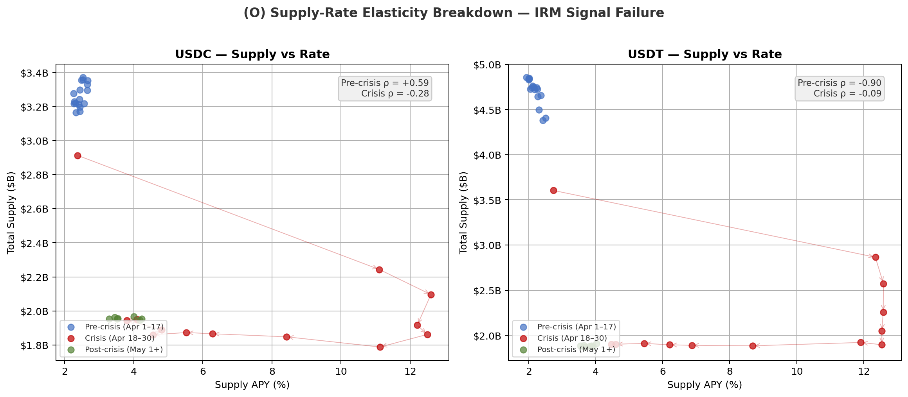

The scatter plot reveals the structural break. Pre-crisis, USDC supply showed a positive correlation with APY (ρ = +0.59) — the expected behavior. During the crisis, this relationship inverted: USDC supply-APY correlation dropped to ρ = −0.28. Supply fell from $3.24B to $1.87B (−42.5%) while APY rose from 2.5% to 12.6%. For USDT, the pattern is starker: supply collapsed from $4.41B to $1.88B (−57.2%) across the same APY range.

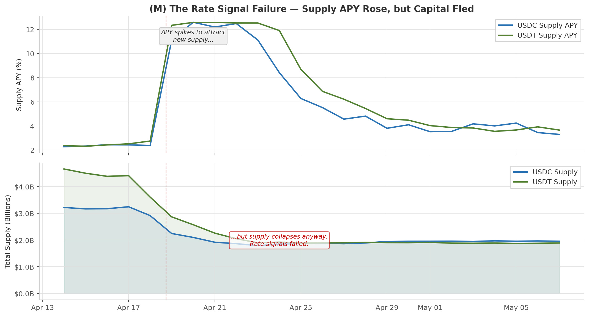

This is not a temporary dislocation — it is a regime change. The IRM's rate signal mechanism assumes a supply curve with positive slope. Under crisis conditions, the supply curve inverts: higher rates signal danger, not opportunity, and capital flees faster.

#### Risk Compensation Under the Current IRM

Even if new capital had arrived, the compensation was structurally inadequate. A formal actuarial decomposition of the actual costs borne by suppliers during this event:

| Risk Component | Derivation | Annual Cost (per $1 supplied) |
|---|---|---|
| Bad debt socialization | $123M / $20.7B TVL | 0.594% |
| Freeze opportunity cost | 12.6% APY × (304.8h / 8,760h) | 0.438% |
| Gas friction (crisis rebalancing) | ~$50/txn × 10 txns / $100K avg position | 0.500% |
| **Total actuarial floor** | | **1.53%** |

*Assumptions: 1 event of this magnitude per year, $100K average position, 10 rebalancing transactions during crisis at ~$50 L1 gas.*

At 1 event per year, the total actuarial cost (1.53%) falls within the pre-crisis supply APY range (USDC: 2.45%, USDT: 2.17%). Under this frequency assumption, the IRM's offered rate covers the expected loss — but just barely, and only in expectation. The actual distribution of outcomes is binary: in 364 of 365 days the supplier earns 2.5%; on the 365th day they face a 45% TVL drawdown, weeks-long withdrawal freeze, and bad debt socialization. The variance is extreme, and the IRM offers no premium for it.

The frequency assumption itself is fragile. The DeFi industry has experienced multiple exploits exceeding $100M in the past 24 months (Euler: $197M March 2023, Mango: $114M October 2022, Radiant: $50M+ October 2024, KelpDAO: $290M April 2026). At 2+ events per year, the actuarial floor exceeds the APY — and critically, these events are correlated (each exploit increases withdrawal pressure across all lending markets, not just the directly affected one).

The core failure: the Aave IRM prices utilization, not risk. It cannot distinguish between a 90% utilization driven by organic ETH-correlated looping demand (low tail risk) and 90% utilization driven by crisis-trapped positions with frozen collateral (extreme tail risk). Both produce the same borrow rate, but the risk profiles differ by orders of magnitude.

This is also why stablecoin TVL in DeFi is a bullish signal for crypto markets: this capital can be rapidly redeployed to buy spot. When stablecoins leave to fiat, it signals permanent exit demand. The rsETH crisis threatened to convert the former into the latter — turning structurally sticky DeFi capital into a panic liquidation.

### The Yield Aggregator Trap

Dan Robinson has articulated the fundamental problem with naive multi-collateral lending: *"Adding a second yield source roughly doubles your risk but doesn't double your expected yield, since you can only lend to one at a time."* This risk/reward asymmetry means that passive depositors in aggregated pools are systematically undercompensated for the tail risk they bear — exactly the tail risk that materialized on April 18.

Interest rate swaps invert this dynamic. Instead of passively accepting whatever rate the IRM produces — and bearing all the tail risk of utilization spikes — a depositor can sell fixed-rate protection and earn a premium for explicitly underwriting rate risk. The risk is priced, bounded, and voluntarily assumed, rather than socialized across all pool participants via an algorithm that cannot distinguish a bank run from organic demand.

---

## Conclusion

The rsETH exploit did not reveal a flaw in Aave's code — it revealed a flaw in DeFi's market structure. Lending protocols have scaled to tens of billions in TVL without a corresponding market for managing the primary risk their users face: interest rate volatility.

The result was predictable: when rates spiked, the only available responses were panic (withdraw/repay), governance lobbying (forum debates), and emergency capital coordination (DeFi United). Each of these is slow, adversarial, and generates negative externalities — legal threats, asymmetric treatment, and prolonged market dysfunction.

An on-chain interest rate swap market would have provided what was missing: a price signal (the term structure), a stabilizing counterparty (the rate short seller), and individual agency (borrower-level hedging). The $290M exploit would still have happened. The 3-week market freeze did not have to.

---

## Sources

1. Galaxy Research, "Block by Block: How the rsETH Exploit Rattled Aave Lending Markets," May 7, 2026.
2. Galaxy Research, "Unpacking Aave: Quantifying the Leverage in DeFi's Largest Looping Market," May 4, 2026.
3. Aave Governance Forum, ARFC discussion thread, April 22–25, 2026. Posts by ChaosLabs, evva, GordonLiao, Yevhen, and others.
4. On-chain Aave V3 Core data — 121,240 `ReserveDataUpdated` events, 184 `LiquidationCall` events in window.

