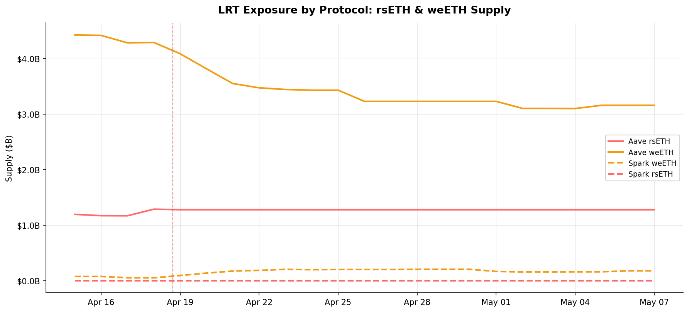
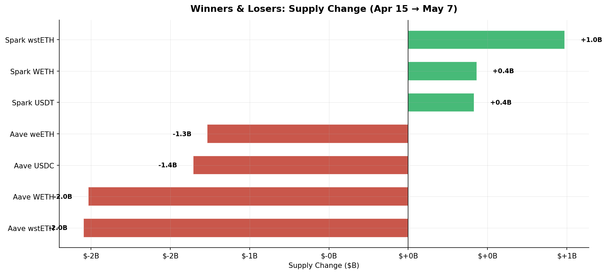
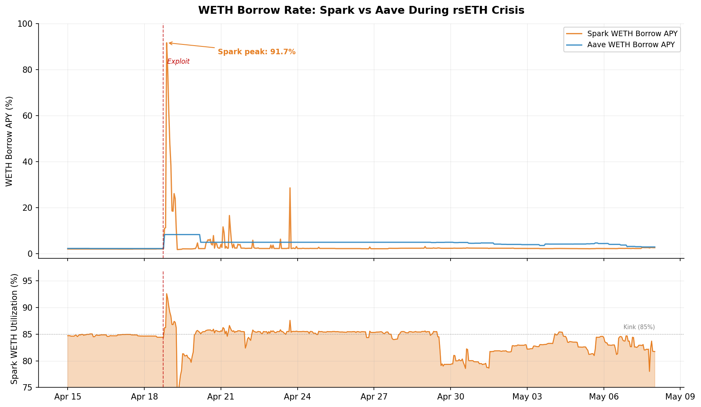
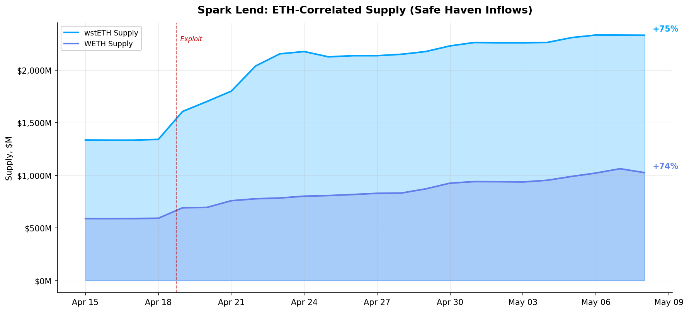
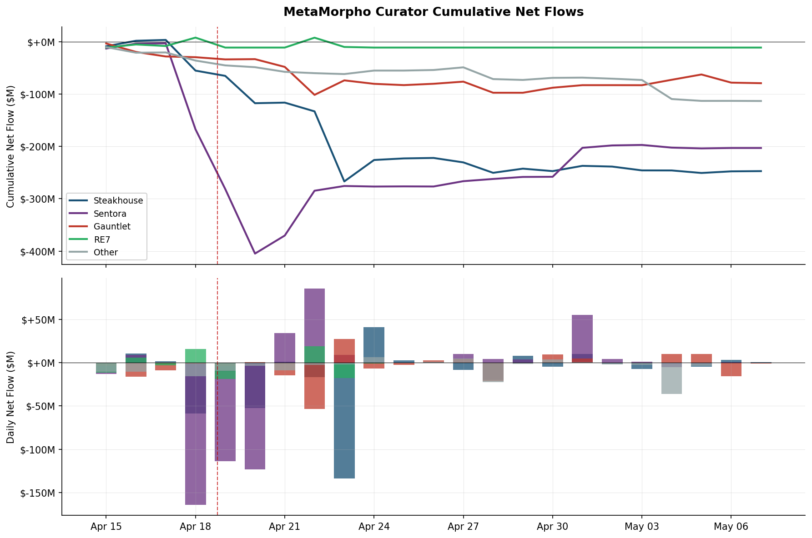
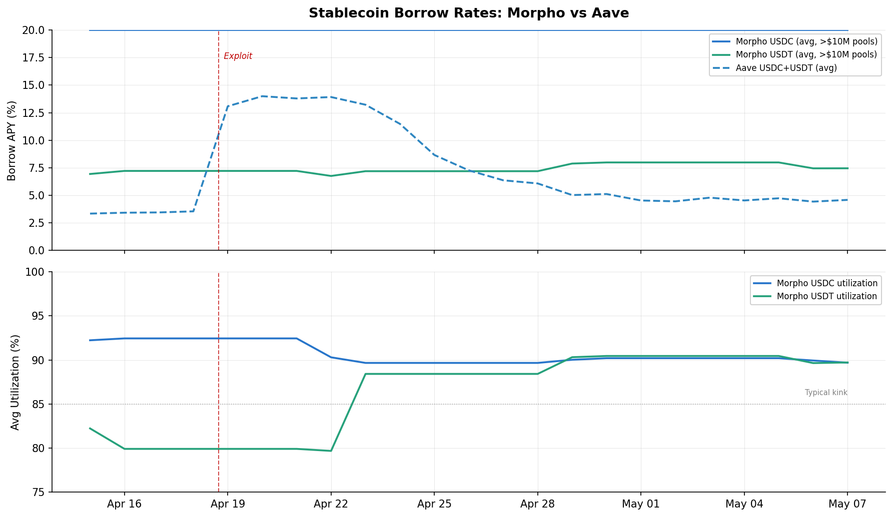

# Post-Kelp Hack: Non-Aave Pool Forensics

> **Scope:** Cross-protocol analysis of Morpho Blue, MetaMorpho curators, and Spark Lend during the rsETH exploit (April 15 – May 8, 2026).
> **Data sources:** RLD ClickHouse — `aave_timeseries`, `spark_timeseries`, `morpho_chainlink_timeseries`, `morpho_market_events`, `morpho_market_metrics`, `metamorpho_vault_flows_hourly`, `metamorpho_vault_registry`, `morpho_market_params`.
> **Companion:** [Aave V3 Forensics](kelp_hack_analysis.md)

---

## 1. Lending Market Share: The Structural Shift

The rsETH exploit catalyzed the largest single-event market share transfer in DeFi lending history.


**Aave's dominance collapsed from 88.0% → 73.7% of three-protocol supply in 21 days.** Spark absorbed the majority, rising from 7.7% → 18.9%. Morpho grew from 4.4% → 7.4%.

| Protocol | Apr 15 Supply | May 7 Supply | Change | Market Share Δ |
|----------|:------------:|:------------|:------:|:--------------:|
| **Aave V3** | $827B | $492B | −$335B (−40.5%) | 88.0% → 73.7% **(−14.3pp)** |
| **Spark Lend** | $72B | $127B | +$55B (+76.4%) | 7.7% → 18.9% **(+11.2pp)** |
| **Morpho Blue** | $41B | $50B | +$9B (+21.0%) | 4.4% → 7.4% **(+3.0pp)** |

The share transfer is permanent through the observation window — Aave showed no recovery trajectory even 3 weeks post-exploit. This is structural, not transient.

---

## 2. Who Had LRT Exposure

The exploit vector was rsETH as collateral in shared lending pools. Exposure determined who was vulnerable:



### Aave: Maximum Exposure

| Asset | Pre-Hack Supply | Post-Hack Supply | Drawdown |
|-------|:--------------:|:----------------:|:--------:|
| **weETH** | $4.43B | $3.16B | **−$1.27B (−28.7%)** |
| **rsETH** | $1.19B | $1.28B | +$0.09B (frozen — no exits possible) |

Aave carried **$5.6B in combined LRT exposure** — rsETH and weETH together represented ~27% of Aave's total supply. Because Aave uses a shared liquidity pool, the rsETH poison infected the entire WETH market, trapping all borrowers.

**Critical finding:** rsETH supply on Aave _increased_ from $1.19B to $1.28B on the exploit day and then froze. The rsETH was non-withdrawable — supply was locked as collateral backing positions that couldn't be liquidated due to the oracle manipulation.

### Spark: Minimal Exposure

Spark had weETH listed but at **negligible scale** (sub-$200M). It had no rsETH market. This is why Spark's WETH pool recovered in 48 hours — the exploit vector simply didn't exist in sufficient size.

### Morpho: Isolated Exposure

Morpho had **77 LRT-collateralized markets** across weETH, ezETH, and rsETH:

| Collateral | Loan | Markets | LLTV Range |
|:----------:|:----:|:-------:|:----------:|
| weETH | WETH | 6 | 86–94.5% |
| weETH | USDC | 8 | 77–86% |
| weETH | USDT | 5 | 77–86% |
| weETH | PYUSD | 4 | 86% |
| weETH | RLUSD | 2 | 86% |
| rsETH | WETH | 3 | 86–94.5% |
| rsETH | wstETH | 1 | 94.5% |
| ezETH | WETH | 5 | 62.5–94.5% |

But each market is a standalone risk container. A weETH/USDC pool at 86% LLTV could implode without touching the adjacent WETH/wstETH pool. **This is the structural advantage of isolated markets — the architecture prevented contagion by design.**

---

## 3. Winners & Losers: The Capital Migration



### Losers: Aave Across the Board

| Market | Supply Change | Mechanism |
|--------|:------------:|-----------|
| **Aave wstETH** | −$2.0B | Collateral flight — wstETH suppliers withdrew to avoid shared-pool contamination |
| **Aave WETH** | −$3.0B | Utilization lock prevented withdrawals; some capital escaped during brief dips |
| **Aave USDC** | −$1.4B | Synthetic exit unwinding — borrowers repaid as rates normalized post-Slope 2 adjustment |
| **Aave weETH** | −$1.3B | LRT confidence collapse — weETH (Ether.fi) suffered guilt-by-association with rsETH |

### Winners: Spark Captured the Fleeing Capital

| Market | Supply Change | Mechanism |
|--------|:------------:|-----------|
| **Spark wstETH** | +$1.0B | Direct migration from Aave — depositors moved wstETH to an rsETH-free pool |
| **Spark WETH** | +$0.4B | WETH suppliers seeking functional pools with no utilization lock |
| **Spark USDT** | +$0.4B | Stablecoin diversification — Spark USDT had lower utilization headroom |

**The $1.0B wstETH inflow to Spark almost exactly mirrors the $2.0B outflow from Aave** (the gap is partially explained by wstETH that moved to Morpho or was unwrapped to ETH).

---

## 4. Spark WETH: The Sharpest Rate Event



Spark's WETH borrow rate spiked to **91.69%** on April 18 — 11× higher than Aave's peak of 8.35%. This happened because:

1. **Steeper IRM:** Spark's Slope 2 reacts more aggressively above the kink (85% utilization)
2. **Utilization spike:** 85% → 92.6% as capital inflows lagged borrow demand
3. **No utilization lock:** Peak was 92.6%, never reaching the 100% ceiling that trapped Aave

The critical difference: **Spark self-corrected in 48 hours.** The aggressive rate repelled marginal borrowers immediately. By April 20, WETH borrow APY was back to 7.92%. By April 24: 2.83%. No governance intervention. No forum debate. No legal threats.



The inflows were monotonic — once capital started moving to Spark, it stayed. wstETH supply grew from $1.34B to $2.33B (+74.6%) with no reversals.

---

## 5. MetaMorpho Curators: Who Lost Market Share



### Curator Scorecard

| Curator | Acute Phase (Apr 18-22) | Recovery (Apr 23-May 7) | Total Net Flow | Verdict |
|---------|:----------------------:|:----------------------:|:--------------:|:-------:|
| **Sentora** | **−$367M** | +$77M | **−$290M** | **Biggest loser.** PYUSD/RLUSD vaults hemorrhaged. |
| **Steakhouse** | −$119M | −$112M | **−$231M** | **Sustained bleed.** Never recovered. Apr 23 single-day −$134M. |
| **Gauntlet** | −$37M | +$23M | **−$14M** | **Resilient.** USDC Prime recovered. WBTC bridge hurt. |
| **RE7** | +$6M | −$21M | **−$15M** | **Neutral.** Spark Blue Chip USDC vault was through-flow. |
| **Other** | −$38M | −$53M | **−$91M** | Small vaults collectively bled steadily. |

### The Sentora Collapse

Sentora's PYUSD and RLUSD vaults lost **−$367M in 4 days** (April 18–22). This is the single largest curator-level outflow event in MetaMorpho history. The mechanism:

- Sentora vaults held exotic stablecoins (PYUSD, RLUSD) with limited underlying liquidity
- Users panicked and redeemed, forcing the vault to withdraw from underlying Morpho Blue markets
- No curator intervention was detected — Sentora did not reallocate, adjust caps, or communicate

### Steakhouse: Death by a Thousand Cuts

Unlike Sentora's acute blowout, Steakhouse's losses were distributed across 23 vaults over the full period. The worst single day was April 23 (−$134M from Steakhouse Reservoir USDC), five days _after_ the exploit — suggesting the outflow was driven by delayed risk reassessment rather than panic.

### Gauntlet: The Survivor

Gauntlet was the only major curator to approach net-neutral. Its USDC Prime vault actually gained +$47M over the period, absorbing capital from smaller vaults. The WBTC Bridge vault lost −$47M, but this was offset by stablecoin inflows.

---

## 6. Morpho Blue Markets: Isolation Under Stress



### Rate Containment

Morpho's large stablecoin pools ($10M+ supply) maintained remarkably stable borrow rates — USDC averaged ~7.5% and USDT averaged ~7.5% throughout the crisis. Compare this to Aave where stablecoin rates spiked to 13–14% and remained elevated for weeks due to the "synthetic exit" demand from trapped borrowers.

### Pool-Level Drawdowns Were Severe But Contained

| Pool (by entity_id) | Peak Supply | Min Supply | Drawdown | Peak Borrow APY |
|---------------------|:----------:|:---------:|:--------:|:--------------:|
| USDC pool #1 | $621M | $143M | **77.0%** | 800% (IRM cap) |
| USDC pool #2 | $330M | $77M | **76.6%** | 800% (IRM cap) |
| USDT pool #3 | $41M | $8M | **80.7%** | 7.12% |
| USDT pool #4 | $39M | $4M | **90.1%** | 4.47% |

Two USDC pools hit the 800% AdaptiveCurveIRM hard cap — far more violent than Aave's capped rates. But the critical difference: **these pools existed in isolation.** The USDC/weETH pool at 800% APY did not infect the USDC/wstETH pool at 5.49% sitting next to it.

### Liquidations: Normal Baseline

Only **7 liquidations** occurred during the acute crisis window (April 18–22) on Morpho, versus 184 on Aave. There was a spike of **191 liquidations on May 5**, but this correlates with a separate market price move, not the Kelp contagion.

---

## 7. Cross-Protocol TVL Divergence


The TVL chart shows the starkest divergence: Aave's TVL collapsed from ~$500B to ~$270B net, while Spark grew from $50B to $90B and Morpho held steady at ~$4B net. The three protocols experienced the same external shock but their architectural differences determined their outcomes.

---

## 8. The Isolation Gradient: Empirical Proof

```
Most Isolated                                              Least Isolated
├── Morpho Blue ──────── MetaMorpho Vaults ──────── Spark ──────── Aave ──┤
    (per-market)         (curated baskets)          (shared pool, (shared pool,
                                                     no rsETH)    WITH rsETH)
```

| Metric | Morpho Blue | Spark | Aave |
|--------|:-----------:|:-----:|:----:|
| WETH utilization peak | ~90% (per-market) | 92.6% | **100% (12.7 days)** |
| Market share change | **+3.0pp** | **+11.2pp** | **−14.3pp** |
| Liquidations (crisis) | 7 | 6 | 184 |
| Governance intervention | None | None | Multiple |
| Rate normalization | Self-correcting | **48 hours** | **3+ weeks** |
| Legal threats | None | None | Active |

---

## 9. Implications

### For Protocol Design
The data proves that **isolation level directly predicts crisis severity**. Morpho's per-market architecture and Spark's conservative asset listing both prevented the contagion that destroyed Aave's WETH market. The cost of isolation (lower capital efficiency) is revealed as insurance premium, not deadweight loss.

### For Curator Risk Management
MetaMorpho curators were **entirely passive** during the crisis. No reallocations, no cap adjustments, no governance actions. This is either:
- **(a) The model working perfectly** — users exited directly, no intervention needed
- **(b) Curators being unprepared** — $367M outflow from Sentora suggests at minimum a failure of depositor communication

The data supports (a) for Gauntlet (net-neutral) and (b) for Sentora (catastrophic outflows with no response).

### For IRS Design
The 91.69% → 2.31% Spark rate move over 48 hours — with $589M in underlying WETH — is the most profitable IRS short opportunity in the dataset. An IRS market spanning Aave/Spark/Morpho would have:
1. Price-discovered the cross-protocol rate spread immediately
2. Directed capital flows toward equilibrium algorithmically
3. Allowed Sentora vault depositors to hedge their effective rate exposure instead of panic-withdrawing

---

*All data sourced from RLD ClickHouse event-level tables. No synthetic data. Charts reference relative paths within `aave_kelp_analysis/`.*
