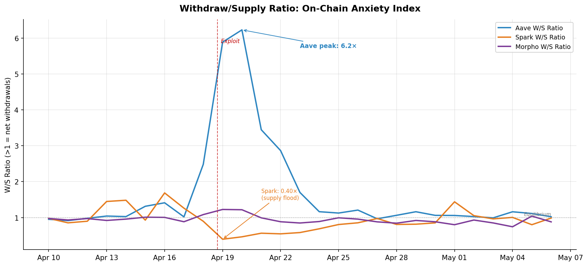
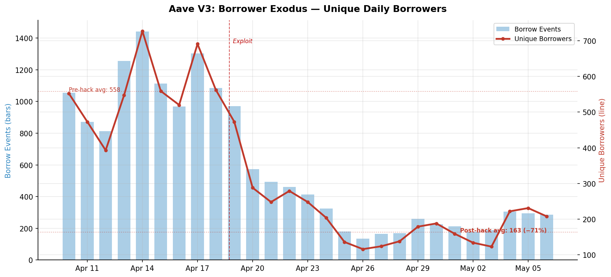
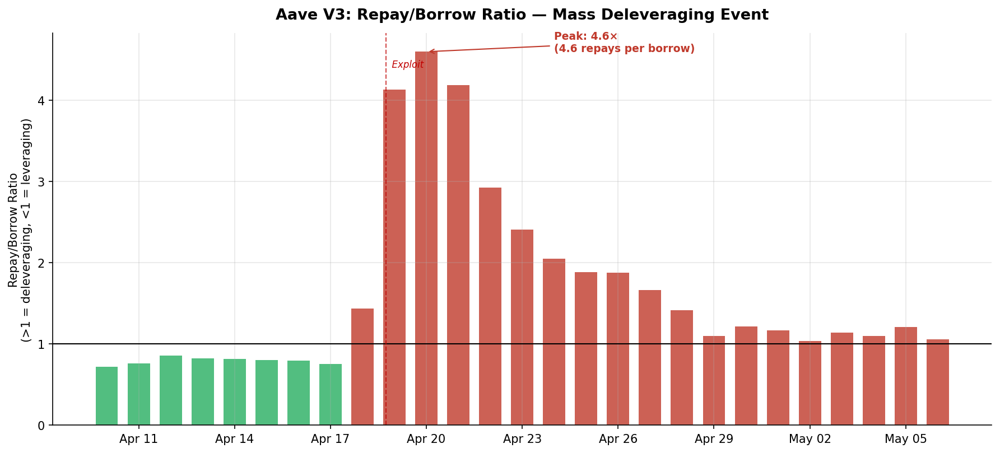
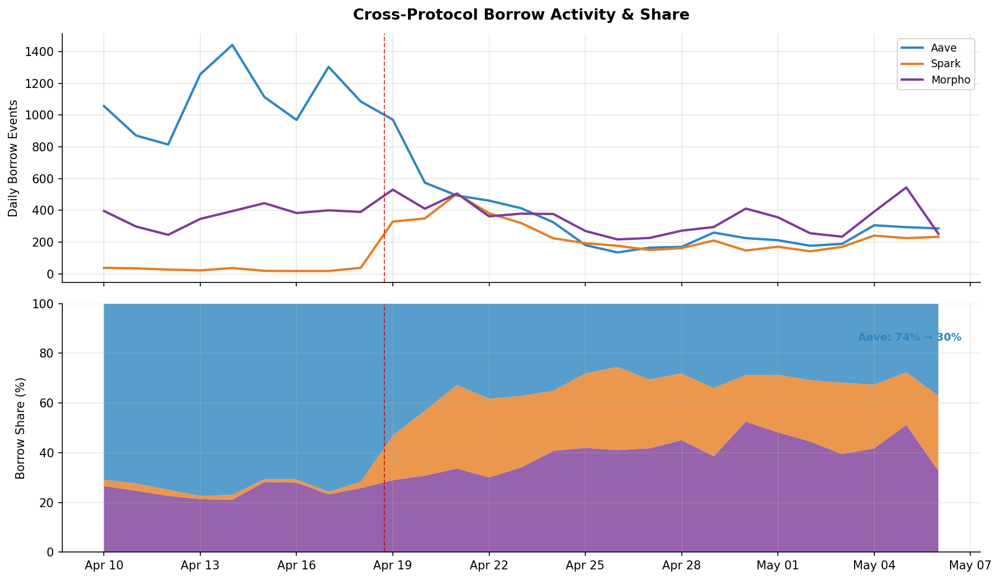
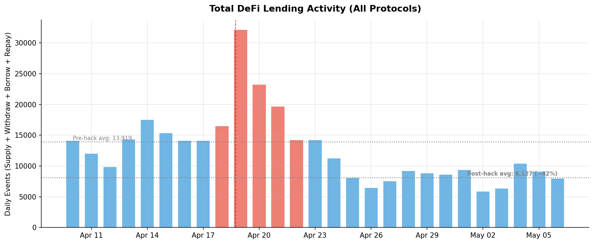
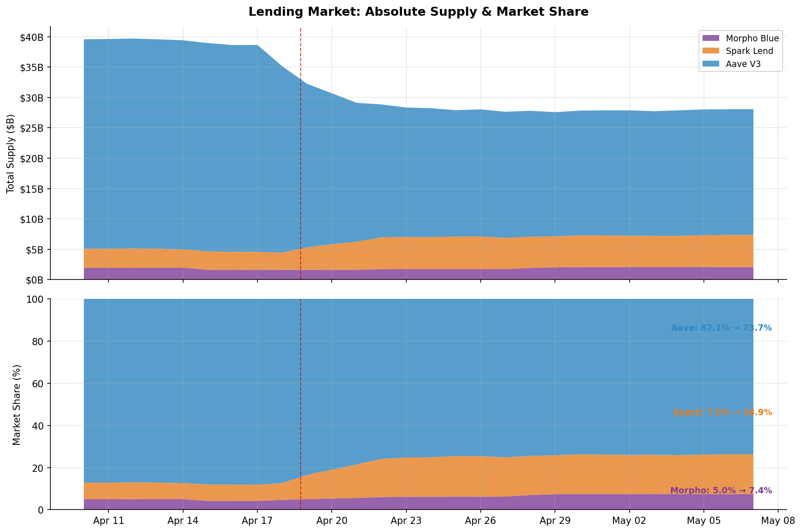
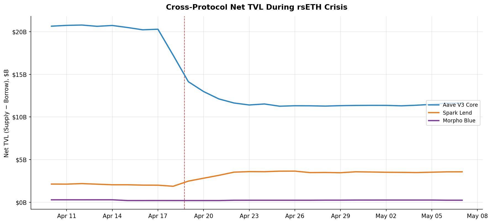

# User Anxiety & Market Structure Post-Kelp Hack

> On-chain behavioral analysis of DeFi lending market participants during and after the rsETH exploit (April 10 – May 7, 2026).
> Protocols: Aave V3 Core, Spark Lend, Morpho Blue.
> Data: RLD ClickHouse event-level tables (no synthetic data).

---

## Executive Summary

The rsETH exploit did not just drain $13.6B from Aave — it structurally changed how DeFi users interact with lending protocols. On-chain behavioral data reveals three phases of user response: **acute panic** (Apr 18–22), **sustained reluctance** (Apr 23–May 1), and a **new equilibrium** (May 2+) where users permanently redistributed across protocols. The market never returned to pre-hack participation levels.

| Metric | Pre-Hack (Apr 10–17) | Post-Hack Steady State (May 2–7) | Change |
|--------|:--------------------:|:--------------------------------:|:------:|
| Total daily lending events | 13,919 | 8,127 | **−42%** |
| Aave unique daily borrowers | 558 | 163 | **−71%** |
| Aave borrow share | 74% | 30% | **−44pp** |
| Aave supply market share | 87.1% | 73.7% | **−13.4pp** |

---

## 1. The Anxiety Index: Withdraw/Supply Ratio

We define a simple on-chain **anxiety index** as the ratio of daily Withdraw events to Supply events. A ratio above 1.0 means more users are pulling capital out than putting it in.

### Aave: Peak Anxiety of 6.2×

On April 20, Aave recorded **6.2 withdrawals for every 1 supply** — a ratio never seen in normal operation (baseline: ~0.8–1.0). The anxiety spike lasted 5 full days above 2.0× before gradually decaying to ~1.1× by April 29. Even by May 7, the ratio had not returned to pre-hack equilibrium — it hovered at 1.0–1.2×, indicating persistent net outflow pressure.

### Spark: Inverted Signal — Supply Flood

Simultaneously, Spark's W/S ratio collapsed to **0.40×** (April 19) — meaning 2.5 supply events for every withdrawal. This is the quantitative signature of a **flight to safety**: users were not just leaving Aave, they were actively deploying capital into the alternative. Spark's ratio normalized by April 25 as the initial migration wave completed.

### Morpho: Mild Tremor, No Panic

Morpho's W/S ratio peaked at only **1.22×** (April 19–20) — barely above baseline. Within 2 days it was back to sub-1.0. The isolated market architecture did not generate the same contagion anxiety because users knew their specific market exposure was unrelated to rsETH.

---

## 2. The Borrower Exodus: Permanent User Loss

Borrow events are the clearest signal of user confidence — borrowing requires trust that the protocol will remain functional, liquid, and fairly priced. The data shows a catastrophic and permanent collapse in Aave borrowing.

### Quantitative Collapse

| Period | Avg Daily Borrow Events | Avg Unique Borrowers | Interpretation |
|--------|:----------------------:|:--------------------:|----------------|
| Pre-hack (Apr 10–17) | 1,089 | 558 | Normal activity |
| Acute crisis (Apr 18–22) | 717 | 370 | Immediate −34% drop |
| Sustained reluctance (Apr 23–30) | 224 | 166 | **−79% from baseline** |
| New equilibrium (May 1–7) | 244 | 180 | **−78% from baseline** — no recovery |

The pre-hack daily average of **558 unique borrowers** collapsed to **163** — a **71% permanent reduction** in Aave's active borrower base. This is not a temporary shock. Three weeks after the exploit, borrower counts showed zero recovery trajectory.

### Why Borrowers Left Permanently

1. **Trust breach:** A protocol that can freeze your WETH for 12.7 days is no longer reliable for active leveraged strategies
2. **Governance uncertainty:** The legal threats from DeFi United (tort doctrine arguments, class action references) created regulatory ambiguity around Aave governance decisions
3. **Rate unpredictability:** Borrowers who experienced the Slope 2 adjustment mid-crisis learned that governance can unilaterally change the cost of their position
4. **Better alternatives materialized:** Spark and Morpho proved they could handle stress without governance intervention

---

## 3. Mass Deleveraging: The Repay/Borrow Ratio

The Repay/Borrow ratio captures the system-wide deleveraging impulse — when users rush to close positions faster than new ones are opened.

### Pre-Hack Regime (Green bars < 1.0)

Before April 18, the R/B ratio was consistently **0.72–0.86** — the system was net-leveraging. More borrows than repays is the healthy equilibrium of a growing lending market.

### Deleveraging Cascade (Red bars > 1.0)

On April 20, the R/B ratio peaked at **4.6×** — 4.6 repayments for every new borrow. This is a system-wide margin call where users are liquidating positions en masse. The deleveraging cascade lasted **20 consecutive days** above 1.0 (April 18 – May 7), never returning to the net-leveraging regime.

### The "Never Below 1.0 Again" Signal

Even by May 7, the R/B ratio was 1.06. The pre-hack regime of net-leveraging (ratio < 1.0) has not returned. This means Aave is structurally deleveraging — users are reducing exposure faster than new participants are entering. For a lending protocol, this is the on-chain equivalent of a bank run that transitions into a chronic deposit flight.

---

## 4. Borrow Activity Share: The Market Structure Shift

### Before: Aave Monopoly

Pre-hack, Aave commanded **74% of all borrow events** across the three protocols. Spark was negligible (~3%). Morpho held ~23%.

### After: Three-Way Market

By April 25, borrow activity had permanently restructured:

| Protocol | Pre-Hack Borrow Share | Post-Hack Borrow Share | Change |
|----------|:--------------------:|:---------------------:|:------:|
| **Aave** | 74% | 30% | **−44pp** |
| **Morpho** | 23% | 38% | **+15pp** |
| **Spark** | 3% | 32% | **+29pp** |

Spark went from a rounding error to a major borrowing venue in 72 hours. Morpho absorbed a moderate share increase. Aave lost its monopoly position permanently.

### The April 21 Crossover

On April 21, **Spark surpassed Aave in daily borrow events** for the first time (504 vs 493). This crossover has not reversed. By May 6, Spark and Morpho each individually generated more borrow events than Aave.

---

## 5. Total Market Activity: The Contraction

### The Market Shrunk — Not Just Redistributed

Total daily lending events across all three protocols dropped from a pre-hack average of **13,919** to a post-hack average of **8,127** — a **42% contraction**. This means the hack didn't just redistribute users from Aave to Spark/Morpho — it drove a significant fraction of users out of DeFi lending entirely.

### The April 19 Spike: Panic Activity

April 19 recorded **32,130 events** — 2.3× the normal volume — as users rushed to withdraw, repay, and reposition. This is the on-chain signature of panic: activity spikes as users frantically exit, then collapses as the remaining participants settle into lower activity levels.

### Post-Hack Decline Is Structural

The post-hack activity level (6,000–10,000 daily events) shows no recovery trend through May 7. Given that Spark and Morpho both gained users, this means the users who left Aave mostly left DeFi lending entirely rather than migrating to alternatives.

---

## 6. Lending Market Supply Share (Corrected)

### Corrected Numbers (end-of-day snapshots)

| Protocol | Apr 10 Supply | May 7 Supply | Change |
|----------|:-------------|:------------|:------:|
| **Aave V3** | $34.3B | $20.7B | **−$13.6B (−40%)** |
| **Spark Lend** | $3.0B | $5.3B | **+$2.3B (+77%)** |
| **Morpho Blue** | $1.6B | $2.1B | **+$0.4B (+27%)** |
| **Total** | $38.9B | $28.1B | **−$10.8B (−28%)** |

Note: $13.6B left Aave, but only $2.7B arrived at Spark + Morpho. The remaining **$10.9B left DeFi lending entirely**. This is the quantitative measure of user anxiety — 80% of capital that fled Aave did not re-enter any top lending protocol.

---

## 7. Cross-Protocol Net TVL

Corrected for end-of-day snapshots. Aave net TVL (supply − borrow) collapsed from $20.5B to $11.6B. Spark grew from $2.0B to $3.6B. Morpho grew from $0.2B to $0.2B (unchanged net — its growth was matched by borrow demand).

---

## 8. Synthesis: The Anatomy of DeFi User Anxiety

### Phase 1: Panic (Apr 18–22)
- **Duration:** 5 days
- **Signature:** W/S ratio spike to 6.2×, R/B ratio to 4.6×, 32K daily events
- **Behavior:** Users withdraw everything they can from Aave; simultaneously flood into Spark
- **Capital flight:** $13.6B leaves Aave; $2.3B arrives at Spark

### Phase 2: Reluctance (Apr 23–May 1)
- **Duration:** 9 days
- **Signature:** W/S ratio elevated at 1.1–1.7×, borrow events −79%, unique borrowers −71%
- **Behavior:** No new capital entering; existing positions slowly deleveraging; governance debate ongoing
- **Key observation:** Users are not returning even as rates normalize

### Phase 3: New Equilibrium (May 2+)
- **Duration:** Permanent (through end of observation)
- **Signature:** Activity 42% below pre-hack, Aave borrow share 30% (was 74%), three-way market
- **Behavior:** Remaining users accept the new structure; no recovery trajectory visible
- **Key observation:** $10.9B that left Aave never returned to any lending protocol

### The Permanent Damage

The on-chain evidence is unambiguous: **the Kelp hack permanently reduced DeFi lending market participation by ~42% and destroyed Aave's lending monopoly.** This is not a temporary shock — it's a structural regime change in how capital allocates across lending protocols.

For the IRS thesis: the 42% activity contraction and 80% non-return rate of fleeing capital suggest that **rate volatility alone** (without hedging instruments) is sufficient to drive permanent user exit from DeFi lending markets. An IRS market that could have capped user rate exposure during the crisis would have retained the fraction of users who left due to rate unpredictability rather than security concerns.

---

*All data sourced from RLD ClickHouse event-level tables. Charts use end-of-day snapshots (argMax per entity per day) for supply/borrow figures, event counts for behavioral metrics.*
