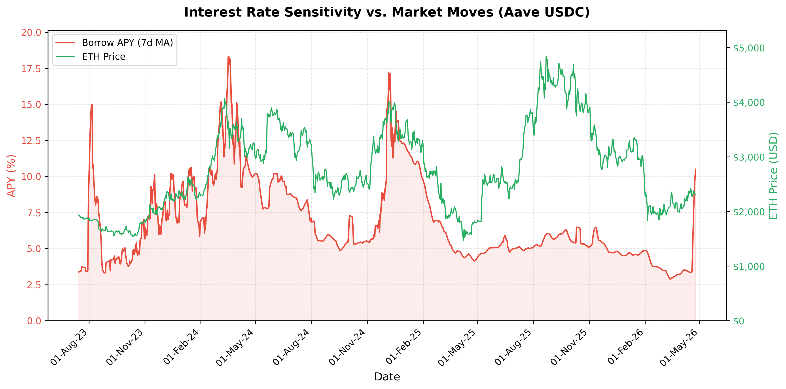

Decentralized Finance (DeFi) lending markets secure billions of dollars in capital, yet participants remain exposed to systemic vulnerabilities: extreme interest rate volatility and catastrophic liquidity risks. RLD Protocol introduce a new architecture that unifies fixed-income structuring, yield & volatility speculation, and protocol solvency insurance into a single, scalable liquidity layer.

### Problem

In traditional finance, interest rates are discretionary and adjust smoothly. In DeFi, interest rates are governed by rigid algorithmic utilization curves. This creates an environment characterized by:

1. **Extreme Volatility**: Algorithmic rates serve as a leveraged proxy for crypto asset volatility, often experiencing explosive convex spikes during periods of high leverage demand.
2. **Jump-to-Default Risk**: Yield-bearing collateral exposes lenders not to continuous diffusion risks, but to Poisson jump-to-default risks (e.g., smart contract exploits or depegs), which algorithmic interest rate models natively fail to price.
3. **Liquidity Fragmentation**: Existing attempts to manage these risks rely on dated interest rate swaps or fixed-term zero-coupon bonds, which hopelessly fragment liquidity across specific maturity dates and strike prices.

### Solution

This data room details the mathematical and structural architecture of a novel derivative primitive that tracks the interest rate of a lending pool rather than an asset price. By defining the index price as a scalar of the borrowing rate $P = K \cdot r_t$, we convert abstract yield volatility into a tangible, tradable asset.

**Core Innovations:**

- **Rate-Level Perpetuals (RLP):** A collateralized debt position (CDP) architecture that allows participants to go long or short on algorithmic interest rates using a continuous-time perpetual contract.
- **Synthetic Bonds:** By wrapping the perpetual contract with our execution router, participants can synthesize fixed-yield or fixed-borrowing-cost instruments for ANY programmable duration (from 1 block to 5 years) without fragmenting the underlying liquidity pool.
- **Ghost Router & TWAMM Execution:** A Hub-and-Spoke execution environment that aggregates accrued inventory ("ghost balances") across TWAMM and Limit order engines. By prioritizing global peer-to-peer netting and direct taker intercepts before falling back to Uniswap V4, the router internalizes Coincidence of Wants (CoW), minimizing slippage and eliminating Loss-Versus-Rebalancing (LVR).
- **Amortizing Perpetual Options (AmPO):** A novel mechanism that internalizes decay via a global Normalization Factor, eliminating the necessity for discrete cash funding flows while enabling continuous duration management.
- **Parametric Credit Default Swaps (PCDS):** The utilization of the RLP architecture to create automated, zero-discretion solvency insurance. By indexing against the deterministic rate spikes that occur during liquidity freezes, underwriters can capture a mathematically proven convex risk premium, while depositors are shielded from catastrophic defaults.

By unbundling the components of interest rate risk, duration risk, and default risk into a cohesive suite of primitives, we establish the definitive layer for institutional-grade fixed income in decentralized finance.
